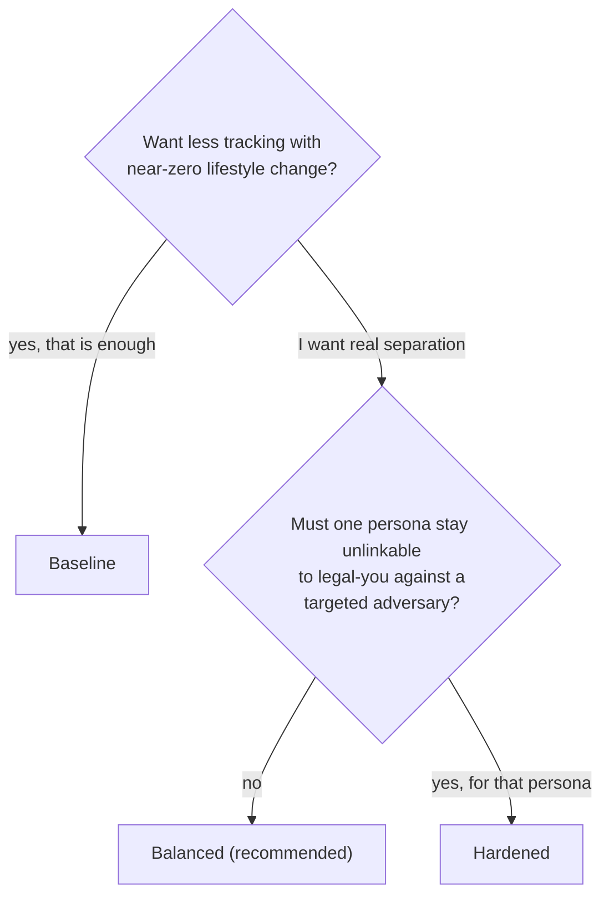
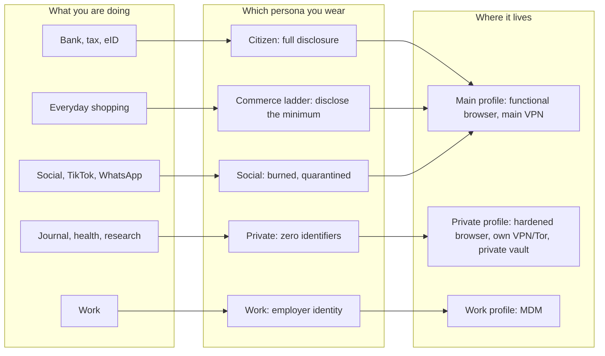
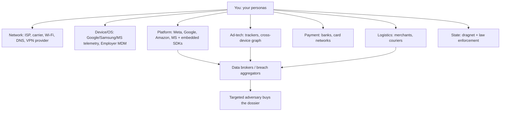
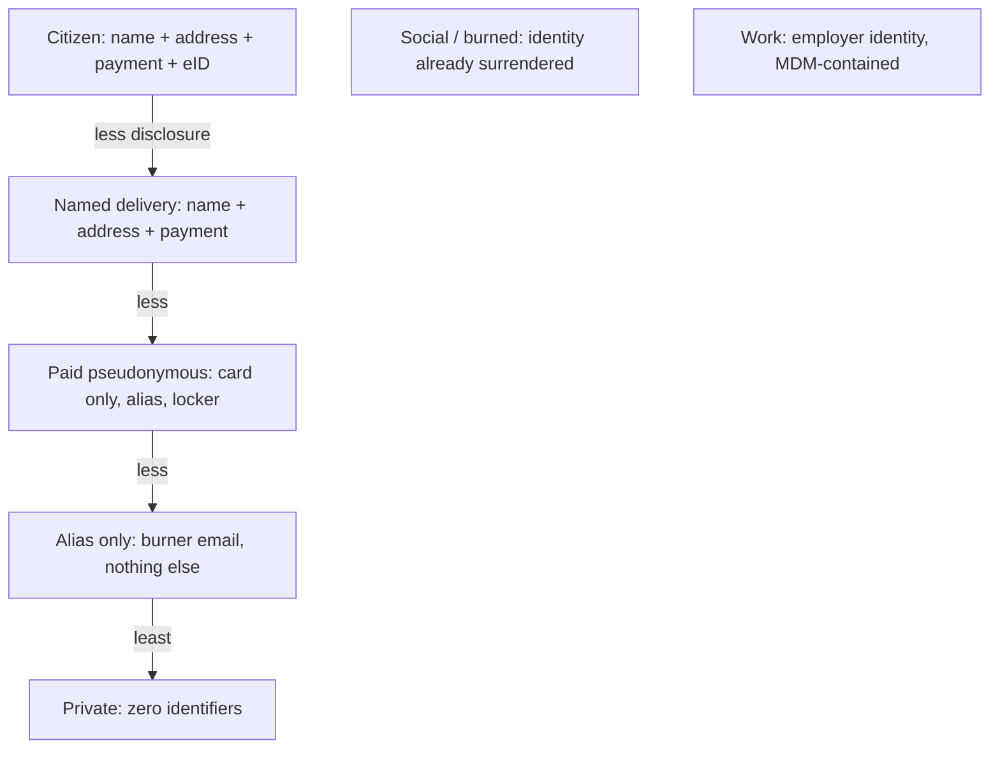
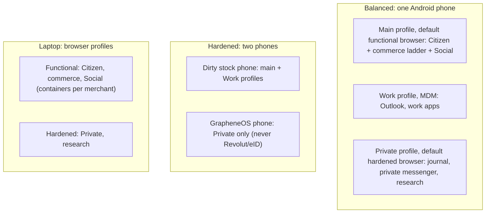
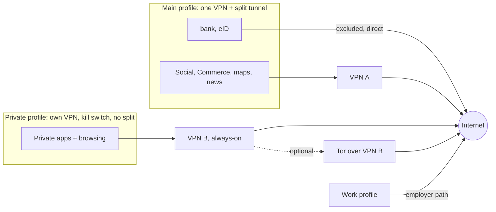
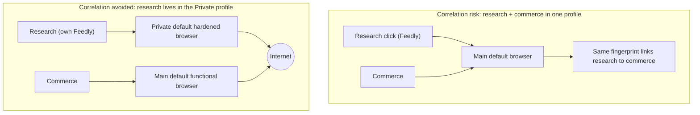
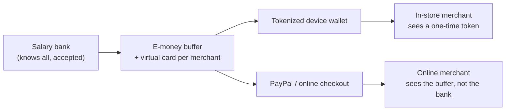
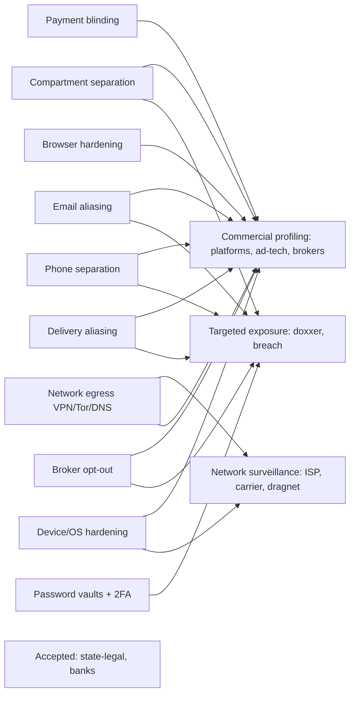

# Who Sees What: A Compartmentalized Digital Identity Playbook

**Premise:** you cannot go off-grid as a modern citizen, but you can decide *who sees what*. This playbook gives you a framework for splitting your digital life into isolated identities ("personas") and the concrete moves to blind commercial, network, and targeted adversaries to the maximum practical extent, while staying a fully functioning banking, government-registered citizen. In spirit it takes the established meta-framework of **privacy by design** (building privacy in by default rather than bolting it on) and applies it at the level of the individual person rather than the organization or system.

> **Compartmentalized Digital Identity (CDI)** means splitting your digital life into separate identities so that each observer sees only one, with no way to link it to the rest. It is not blockchain DIDs or verifiable-credential wallets, which have near-zero real-world acceptance at your bank, e-shops, or the tax office today (see [Where this sits](#where-this-sits-related-work-and-what-ssi-really-means) for how it relates to technical "Self-Sovereign Identity"). This is about what you can actually do this weekend.

*An opinionated playbook, not legal advice. KYC, ID, and data-protection laws vary by country. The "accepted observers" below assume a lawful, compliant user. Unfamiliar terms are defined in the [Glossary](#glossary).*

*Last reviewed: July 2026. Time-sensitive claims (the EUDI rollout, EU age verification, the EU CSA Regulation ("Chat Control"), and NIST SP 800-63B-4) are current as of then; re-check before relying on them.*

---

## Contents

- [TL;DR: pick your tier](#tldr-pick-your-tier)
- [Quick start](#quick-start)
- [1. Purpose & scope](#1-purpose--scope)
- [Where this sits: related work](#where-this-sits-related-work-and-what-ssi-really-means)
- [2. Design principles](#2-design-principles)
- [3. Threat actors](#3-threat-actors)
- [4. Persona model](#4-persona-model)
- [5. Device & network architecture](#5-device--network-architecture)
- [6. Correlation avoidance](#6-correlation-avoidance)
- [7. Solution catalog](#7-solution-catalog)
- [8. Threat × solution mapping](#8-threat--solution-mapping)
- [9. Conflicts & tradeoffs](#9-conflicts--tradeoffs)
- [10. Adoption tiers](#10-adoption-tiers)
- [Red-team: a day in the life](#red-team-a-day-in-the-life)
- [Why this matters (even if you have nothing to hide)](#why-this-matters-even-if-you-have-nothing-to-hide)
- [Your own devices as attack proxies](#your-own-devices-as-attack-proxies)
- [When you confide in an AI chatbot](#when-you-confide-in-an-ai-chatbot)
- [A personal note on children](#a-personal-note-on-children)
- [Glossary](#glossary)
- [Sources](#sources)
- [License](#license)

---

## TL;DR: pick your tier

You don't need all of this. Choose a tier and stop where the effort stops being worth it.

| | **Baseline** (anyone) | **Balanced** (default) | **Hardened** (enthusiast) |
|---|---|---|---|
| **Effort** | An afternoon | A weekend, light upkeep | Ongoing project |
| **Separation** | One identity (tracker reduction, not persona separation) | 3 profiles: main / Private / Work | 3 profiles, Private on its own GrapheneOS phone |
| **Phone numbers** | 1, exposed minimally | 2 (Citizen SIM + everything-else SIM) | 3+ (Citizen / everyday / Private) |
| **Email** | Shared-provider aliases for signups | Mass-alias per merchant; your own domain for the Citizen identity (bank, government) | Own-domain mail for Citizen; a separate pseudonymous mailbox for Private; hardware-key logins |
| **Payments** | Wallet tap-to-pay in store | Virtual cards online; disclose the minimum per merchant | Cash for movement; anonymous top-ups |
| **Browsers** | One functional (Brave + uBlock) | Functional default in main + hardened default in Private | Three: functional, hardened, research/pseudonymous |
| **Vaults** | One password manager | Bulk (Proton Pass) + Core (Bitwarden + hardware key) | + a separate pseudonymous vault for Private |
| **Egress** | HTTPS + encrypted DNS | One VPN, per-profile tunnels (Private kill-switch) | Second anonymous provider on Private, per-device exits, Tor |

**If you do nothing else, follow these five, in priority order:**

1. **Never bridge attributes.** One shared phone number, card, email, or browser fingerprint collapses two personas into one. Danger rank: **phone > payment > email > device fingerprint > name/address.**
2. **Avoid correlation.** Even with separate identifiers, two personas that share a browser fingerprint, a device, or synchronized timing get relinked. Separate fingerprints and profiles; on one phone the device is the bridge, so keep what must never link on separate devices or over Tor.
3. **Stay an integrated citizen.** A setup that de-banks you (breaks Revolut) or locks you out of government eID is a failure, not a win. Hardening lives *beside* your compliant identity, never on top of it.
4. **No clean wins.** Each measure protects some things and not others, and the residual is noted next to it. Privacy is relocated trust, so weigh the tradeoffs instead of chasing perfection.
5. **Smart, not blanket.** Routing *everything* through a VPN or Tor doesn't hide you; it flags you and relocates all trust to one provider. Egress is chosen per persona, per action.

**The whole thing in one picture.** The recommendations above as a single reference architecture, drawn at the **Balanced** tier: four compartments on one shared root of trust. **Private** is the only one sealed on every axis; inside the Main profile, Citizen, Commerce, and Social are kept apart by disclosure discipline, not hard walls (they share the main VPN and functional-browser fingerprint, and Commerce and Social also share the Bulk vault and the everything-else SIM). [Open the interactive version](reference-architecture.html).

*Generic example, not a real setup. The real invariant: no attribute crosses between the Main side, Private, and Work. New here? Unfamiliar terms are in the [Glossary](#glossary).*

---

## Quick start

The rest of this playbook is the framework and the reasoning behind these choices. If you just want to act, start here, then read the sections that matter to you.

**Step 1: how much separation do you need?**

Baseline is a lighter, standalone setup, not a first step toward the others; **Balanced** is the full model; **Hardened** is Balanced plus a dedicated Private device. Pick the lowest tier that meets your need and stop there. The concrete per-tier checklist lives in [Section 10](#10-adoption-tiers); a passive Baseline user may also be better off on iOS's stronger defaults ([Section 5](#5-device--network-architecture)).

**Step 2: match what you are doing to a persona.** The map below is the **Balanced** model (Baseline collapses it to a single profile; Hardened splits Private onto its own phone). What you are doing decides which persona you wear, and the persona decides where it lives:

**Step 3: by scenario (what do I actually do when...).**

| When you want to... | Do this | Tier | More |
|---|---|---|---|
| Bank, pay tax, use eID | Citizen persona, direct or VPN-neutral; never hide from your own bank | Baseline | Sections [4](#4-persona-model), [7.4](#74-payments--banking) |
| Buy something online | Lowest rung that works: alias email, virtual card, parcel locker; give name and address only for a physical delivery | Baseline | Sections [4](#4-persona-model), [7.3](#73-e-commerce--delivery) |
| Use Facebook / TikTok / WhatsApp | Keep it out of your other logins, deny contacts and location, treat it as burned (quarantine it as a compartment inside the Main profile) | Baseline | Sections [5](#5-device--network-architecture), [7.2](#72-social--messaging) |
| Journal, health, sensitive research | Private profile: hardened browser, E2E notes, own VPN/Tor, private vault | Balanced | Sections [4](#4-persona-model), [7.6](#76-journaling--private-notes), [7.7](#77-web-browsing--dns) |
| Message privately | Signal with a username, inside the Private profile | Balanced | [Section 7.1](#71-communications--email) |
| Move around unseen | Location discipline + MAC randomization; cash and an anonymous transit card for sensitive trips | Balanced | [Section 7.5](#75-movement--location) |
| Keep work off your personal life | Work profile with MDM; nothing personal in it | Baseline | Sections [4](#4-persona-model), [5](#5-device--network-architecture) |

---

## 1. Purpose & scope

**Who this is for:** an intermediate-to-power user on a laptop + Android phone (personal + work profile), using Facebook, Instagram, WhatsApp, Amazon, Gmail, and Outlook, who wants a private journal (an E2E notes app such as Standard Notes or Notesnook) and minimized tracking of movement, payments, and shopping, without leaving the digital economy.

**The trust boundary: who we accept vs. who we blind:**

| Accept (lawful, unavoidable) | Minimize (dragnet, reducible) | Blind (max practical) |
|---|---|---|
| Government legal/financial identity | OS/device vendor telemetry | Platforms & mega-corps |
| Banks & card networks | State mass surveillance / metadata | Ad-tech & tracking networks |
| Targeted law enforcement (subpoena) | | Data brokers & resellers |
| | | Merchants, couriers, ISPs, targeted attackers |

We do **not** design against lawful state identification or bank visibility; that path costs more than it returns for a normal citizen. We *do* deny those actors a bonus dragnet, and we blind everyone commercial.

**Domains covered:** communications & email · social & messaging · e-commerce & delivery · payments & banking · movement & location · journaling & private notes · browsing & DNS · device & OS. (Travel/border, crypto/on-chain, and IoT are out of scope, apart from one cross-cutting risk covered in [Your own devices as attack proxies](#your-own-devices-as-attack-proxies); a smartwatch is treated as an extension of the phone under Movement, while vehicle telematics fall under IoT.)

---

## Where this sits: related work, and what "SSI" really means

"Self-Sovereign Identity" (SSI) would be a natural name for what this playbook does, but the term is already taken, and it means something narrower. In the SSI literature it means **proving** who you are with cryptographic credentials you hold and disclose selectively: Christopher Allen's ten principles (Allen, 2016), the W3C standards for **DIDs** and **Verifiable Credentials** (W3C, 2022a, 2022b), and stacks like Sovrin and Hyperledger Aries. Governments have now built exactly that: the EU's **EUDI Wallet** under **eIDAS 2.0** (European Parliament and Council, 2024), which member states must offer every citizen, sits alongside a formal "European Self-Sovereign Identity Framework." The name is taken, and taken officially.

This playbook borrows that world's *values* (data minimization, selective disclosure, user control) but works the **opposite end of the same axis**:

| | Technical SSI (DID / VC / EUDI) | This playbook |
|---|---|---|
| Goal | **Prove** identity, minimally | **Avoid revealing** identity at all |
| Mechanism | Signed credentials, selective disclosure | Compartmentalization, unlinkability |
| Adversary | A verifier who over-asks | Everyone who correlates without asking |
| Status | Standardized, mandated (rolling out from 2026) | A discipline you apply yourself |

A verifiable-credential wallet does nothing against ad-tech fingerprinting, ISP metadata, or a broker stitching your accounts into a dossier, which is this playbook's entire subject. The two are complementary: technical SSI is a better front door, and this is everything the front door never covered. Related architectures in the privacy-by-design tradition point the same way: user-controlled, decentralized identity built from **identity agents** (Toth, Cavoukian and Anderson-Priddy, 2020) aims to give the individual *control over disclosure*, not unlinkability across personas, so it too sits on the *prove/control* side that CDI complements. Beneath all of this sits **Privacy by Design** (Cavoukian, 2010), the meta-framework of building privacy in by default rather than bolting it on; CDI is that philosophy applied to the individual person, with the seven principles mapped in [Section 2](#2-design-principles).

**Named correctly, then.** The mechanisms here are not new, only scattered across fields. Stripped to its parts, this playbook is applied **compartmentalization** (the OPSEC and Qubes tradition, built on the least-privilege principle; Saltzer and Schroeder, 1975), whose formal privacy goal is **unlinkability** and **pseudonymity** (Pfitzmann and Hansen, 2010), whose anonymous-communication roots (mix networks, remailers, onion routing) trace to Chaum (1981), whose guiding theory is **contextual integrity** (Nissenbaum, 2004: a data flow is proper only when it fits the norms of its context), and whose crowd-blending tactic is enlarging your **anonymity set** (Pfitzmann and Hansen, 2010; "gray man" is the colloquial term for it, not an academic one). What is genuinely thin in the existing work is the synthesis for a **fully integrated citizen who is not going dark**. Almost all anonymity literature serves the activist, journalist, or criminal trying to disappear, and the closest institutional guidance, CISA's Project Upskill and its civil-society handbook (CISA, 2024; CISA et al., 2024), is written for high-risk communities and NGOs facing nation-state attackers. Very little serves the person who must stay bankable, employed, and government-registered while still denying everyone a free dossier. That audience, the correlation-first threat model, and the tiering are what this adds.

**EUDI reaches the Citizen persona.** The EU wallet is the concrete form of technical SSI arriving in ordinary hands. Its use is **voluntary and user-initiated** (large platforms must *accept* it but cannot compel it, and pseudonymous use is protected; European Parliament and Council, 2024), and it is an **accepted** identity ([Section 1](#1-purpose--scope)), not one we fight. But it is also a potential correlation hub: one wallet presented everywhere can relink the contexts we keep apart, and the moment you use it to verify a *social* account you have built the Social-to-Citizen bridge yourself, whatever profile the wallet lives in. So treat wallet-based verification as the bridge it is: use it only where hard-compelled, lean on **selective disclosure by default** (prove "over 18" or "resident", never the whole credential), and keep the wallet inside the Citizen persona, never the Private one.

---

## 2. Design principles

Beyond the five headline rules in the TL;DR:

- **Cryptography and open source are the floor everything else stands on.** The rest of this playbook is discipline about who sees what; what makes any of it *enforceable* is mathematics. Strong, openly-published, independently-audited cryptography is the one defense a mega-corporation or an over-invasive government cannot simply overrule: correctly encrypted data is unreadable to anyone without the key, and only open code lets you verify that promise instead of trusting a vendor's word. Push it to the limit with **zero-knowledge architecture**, where the service stores only ciphertext it cannot itself read, so, as Eric Hughes wrote in *A Cypherpunk's Manifesto* (1993), your provider "need not know to whom I am speaking or what I am saying," only how to deliver it.
- **The default is the funnel.** Whatever handler is *default* (browser, but also the email or maps opener) captures every link you click. If your default browser is the shopping one, every article you open, even "private" research, lands there and gets correlated with commerce. So you set defaults **per profile** to match its disclosure level, and never rely on remembering to pick a second app inside a profile.
- **Least privilege / minimum disclosure.** Reveal only what a context forces. Personas are organized by *what you must provide* (name, address, payment, or just an alias), and you drop to the lowest-disclosure identity a task allows.
- **Burned by design.** Your Facebook/Google accounts already hold your real identity. Don't waste effort re-anonymizing them. **Quarantine** them so they can't reach into your other personas.
- **Relational leakage is real.** Your biggest deanonymizer is often other people: a friend uploading their contacts (your number), a tag in a photo, a delivery to a shared address, a bank counterparty. Compartments are only as strong as the people who bridge them (expanded in [Section 6](#6-correlation-avoidance)).
- **Tiered, not all-or-nothing.** Every recommendation carries a tier so you self-select rather than burn out chasing purity.
- **Privacy and security overlap.** Several of these moves harden you against attackers as a bonus, not just against watchers; where that dividend is notable it is flagged inline as *(Security dividend: ...)*.

### The seven Privacy-by-Design principles

These design principles are not invented here; they apply **Privacy by Design** (Cavoukian, 2010), the established meta-framework for building privacy in proactively, at the level of the individual rather than the organization. The mapping:

| Privacy-by-Design principle | How CDI applies it |
|---|---|
| 1. Proactive, not reactive | Design the compartments before exposure; the tiers and the bridge rule are preventative, not clean-up. |
| 2. Privacy as the default | Per-profile defaults (the-default-is-the-funnel), "Only me" audiences, filtering DNS, minimum disclosure by default. |
| 3. Privacy embedded into design | Separation *is* the architecture (personas, OS profiles, per-persona egress), not an add-on. |
| 4. Full functionality (positive-sum) | Kept honestly: you stay fully bankable, employed, and government-registered; where privacy and function genuinely conflict, the residual is stated, not wished away. |
| 5. End-to-end security, full lifecycle | E2E encryption, the shared root of trust, cross-2FA, recovery planning, and device-at-rest. |
| 6. Visibility and transparency | Open-source tools by requirement, and a residual noted beside every recommendation. |
| 7. Respect for the user (user-centric) | The whole playbook is written for one person to apply to their own life, on their own terms. |

In short, CDI is Privacy by Design applied to the individual. The one deliberate departure is **Principle 4**: rather than promise a friction-free positive-sum, CDI treats privacy as *relocated trust* and states the tradeoff openly, which is itself Principle 6 in action.

---

## 3. Threat actors

Characterized by **vantage** (what they can physically see), because solutions map directly onto vantage points. Also scored on reach (mass/targeted), power (observe / buy / legally compel), motive, **linkability** (can they tie it to legal-you?), and our stance.

| # | Actor | Vantage | Reach | Power | Linkability | Stance |
|---|---|---|---|---|---|---|
| 1 | ISP / carrier / public Wi-Fi | Network | Mass | Observe metadata | High (to subscriber) | **Blind** |
| 2 | DNS resolver / VPN provider | Network | Mass | Observe destinations | High | **Relocate trust** |
| 3 | OS & device vendor (Google/Samsung/MS) | Device/OS | Mass | Deep device telemetry | High | **Minimize** |
| 4 | Employer MDM (work profile) | Device/OS | Targeted | Work-profile visibility + policy | High (to employer) | **Contain** |
| 5 | Platforms (Meta, Google, Amazon, MS, ByteDance) | Platform | Mass | First-party data + SDKs in other apps | High | **Blind across personas** |
| 6 | Ad-tech / cross-device graph | Ad-tech | Mass | Stitch behavior into a profile | Med→High | **Blind** |
| 7 | Data brokers / people-search / breach aggregators | Public records | Mass→targeted | Aggregate + resell dossiers | High | **Starve + de-list** |
| 8 | Banks / card networks | Payment | – | See transactions | High | **Accept, limit scope** |
| 9 | Merchants & couriers | Logistics | – | Real name + address + purchase | High | **Blind (alias)** |
| 10 | Government: mass surveillance | State | Mass | Direct + compelled collection | High | **Minimize dragnet** |
| 11 | Government: law enforcement | State | Targeted | Subpoena banks/platforms/telecom | High | **Accept (lawful)** |
| 12 | Targeted individual (doxxer / stalker) | Cross-source OSINT | Targeted | Exploit exposed email/breach data | High | **Blind + harden** |

*Stance verbs: **Accept** (lawful, unavoidable), **Minimize** (shrink the dragnet), **Contain** (isolate to one zone), **Relocate trust** (move it to a party you chose), **Blind** (deny visibility outright), **Starve** (cut off the data supply).*

*The narrative arrow matters: platforms, ad-tech, and logistics feed the brokers; the brokers feed the targeted attacker. Blinding the top of the chain starves the bottom.*

**The adversary model, made explicit.** The table above is a single adversary model, read along four axes. Each actor has a **vantage** (the data it can observe: network, device/OS, platform, payment, logistics, public records, or state), **prior knowledge** (the identifiers it already holds, from none up to your full legal identity), a **capability** (one or more of: *observe* passively, *purchase or aggregate* data from others, *legally compel* disclosure, or *actively attack* a target), and a **goal** (*link* two actions to one subject, *identify* the subject as legal-you, *profile* behaviour over time, or *deanonymize* a specific persona). Every solution in the later sections is placed against these axes: you defeat an actor by removing its vantage, starving its prior knowledge, or raising the cost of the capability it needs to reach its goal.

**The property we target: unlinkability.** The formal goal, in the sense of Pfitzmann and Hansen (2010), is **unlinkability**. Two items of interest (two accounts, sessions, or actions) are unlinkable to an adversary *A* if observing them does not let *A* decide, better than its prior guess, whether they belong to the same subject; for an adversary with vantage *V* and prior knowledge *K*, two personas are unlinkable when *A*'s advantage in telling "same subject" from "different subjects" over *V* stays negligible. Compartmentalization pursues exactly this, by denying the shared attributes (**bridges**, [Section 4](#4-persona-model)) and co-occurrence signals (**correlation**, [Section 6](#6-correlation-avoidance)) that would give *A* an advantage. The adjacent targets are **pseudonymity** (acting under a persistent identifier that is not legal-you, so linkage stops at the pseudonym) and a large **anonymity set** (the crowd an action could equally belong to; the bigger the set, the weaker any linkage). We deliberately do **not** target **undetectability** or **unobservability** (hiding that an action happened at all): against the accepted actors (your bank, the state) those are neither achievable nor wanted, so the whole model is scoped to *unlinkability under observation*, not disappearance.

---

## 4. Persona model

Your Compartmentalized Digital Identity made concrete: a set of identities organized by **least privilege**, by how much each context forces you to reveal. Design by *what you must provide*, then drop to the lowest-disclosure identity a task allows.

**The disclosure ladder** (most revealing at the top):

Personas live in **three OS profiles**, each with its own default browser and egress:

| Persona (disclosure) | Profile / default browser | Email | Payment | Delivery | Vault | 2FA | Egress |
|---|---|---|---|---|---|---|---|
| **Citizen** (full) | Main / functional | primary | primary bank | home | Core (Bitwarden) | hardware, crossed | main VPN (neutral) |
| **Named delivery** | Main / functional | alias | virtual card | home / locker | Bulk (Proton Pass) | app 2FA | main VPN |
| **Paid pseudonymous** | Main / functional | alias | virtual card | locker | Bulk | app 2FA | main VPN |
| **Alias only** | Main / functional | alias | none | none | Bulk | app 2FA | main VPN |
| **Social** (burned) | Main / functional | dedicated | none | none | Bulk | app 2FA | main VPN |
| **Private** (zero) | Private / hardened | private domain | none | none | Private (separate pseudonymous vault) | hardware / crossed | Private VPN / Tor |
| **Work** | Work / employer | work | none | none | employer SSO | employer | employer |

**The commerce ladder is discipline, not compartments.** Named delivery, Paid-pseudonymous, and Alias-only all live in the **main profile** with the same functional browser, Bulk vault, and secondary number. They differ only in what you hand a given merchant: reveal name + address only when a physical delivery truly needs it, payment without a name when shipping to a locker, and just an alias for a free signup. Mega-marketplaces (Amazon) sit in **Social**, not the ladder: they identify you not just by account but by browser fingerprint, OS, installed extensions, and behavior, and they require a real card and a delivery address, so alias tactics buy little. Treat them as burned and hard to isolate; the most you can do is a virtual card, a parcel locker or PO box (or a paid pseudonymous mailbox) for the address, and keeping the account out of your other personas. The ladder is for smaller shops that only see what you give them.

**Why Social rides with Citizen, not apart.** Not because the law forces your identity onto social platforms; it is subtler than that. Social simply isn't a low-disclosure persona to begin with: the big platforms already know legal-you (real name, contacts, years of history), so it is **burned**, and a burned persona gains nothing from its own profile. The regulatory trend only reinforces this mildly: under EU rules large platforms and video services will increasingly require **age verification**, and the EU's age-verification app is built to plug into the EUDI wallet rolling out by the end of 2026 (European Commission, 2025). But what it compels is narrow: **age, not identity**. The tool is explicitly designed to prove you are over 18 *without* revealing who you are, and using the wallet at all is voluntary (European Parliament and Council, 2024). So the honest reason Social rides in main is that it is already exposed, sandboxed from your other apps, and cheap to keep there, not that the state has linked it to your bank.

**Why three profiles.** The main profile carries everything you disclose or have already burned (Citizen, the commerce ladder, Social); the **Private** profile carries what must never correlate with any of it (journal, health, Signal, research); the **Work** profile is the employer's. Apps are sandboxed from each other within a profile, so banking and Facebook coexisting in main is fine, the separation that matters is the Private profile's own default browser, own vault, and own egress (see [Section 5](#5-device--network-architecture)).

**The vocabulary, mapped once.** Three words get used for related things: the **seven personas** group into **four disclosure compartments** (Citizen, Commerce, Social, Private) plus **Work**, and those run in **three OS profiles**. Main holds Citizen, the Commerce ladder, and Social; Private holds the Private persona; Work holds Work. So "compartment" is about *what you disclose* and "profile" is about *where it runs*. Among the four compartments only **Private** is sealed on every axis (Work is a separate, equally-sealed employer profile, not one of the four); the Main-side compartments are held apart by discipline, not walls.

**The bridge rule (rule #1, expanded).** A shared attribute is a bridge; a bridge is a deanonymization. Guard them in this order:

1. **Phone number** is the master key. SIM ↔ 2FA ↔ WhatsApp ↔ bank ↔ eID all pivot on it. One number touching two personas collapses both.
2. **Payment instrument:** a reused card links every merchant to your bank identity.
3. **Email:** reuse is the #1 broker and breach-linkage vector.
4. **Device / browser fingerprint** silently bridges personas even with clean identifiers (see [Section 6](#6-correlation-avoidance)).
5. **Name / address:** the final, hardest tie to legal-you.

---

## 5. Device & network architecture

### Why Android, not iOS

The platform choice is a deliberate tradeoff, and both popular myths are wrong.

**Myth 1: "Apple doesn't track you."** Apple runs its own ad network (App Store, News, Stocks) and profiles you across Apple ID, iCloud, Siri, and Maps. iCloud is not end-to-end encrypted unless you enable Advanced Data Protection. What Apple genuinely does well: App Tracking Transparency (since iOS 14.5) blocks *third-party* cross-app tracking by default, and Apple's revenue is hardware and services, so it does not resell your data to brokers. Apple still discloses user data to governments under lawful court orders (it was named among the 2013 PRISM disclosures; Gellman and Poitras, 2013), so it shields you from commercial tracking, not from lawful state access. Net effect: Apple blinds ad-tech and brokers for you, then profiles you itself inside its walled garden.

**Myth 2: "Android sells everything to the darknet."** Google's business is advertising, so it collects heavily across Search, Chrome, Android, Gmail, Maps, YouTube, and Play, but it keeps the data in-house and sells ad *targeting*, not your raw records. Advertisers never receive your identity. The real Android-specific cost is a *second* first-party collector: the device vendor (Samsung, Xiaomi, and others) piles its own telemetry, ads, and bloatware on top of Google.

| | Apple / iOS | Google + vendor / Android |
|---|---|---|
| First-party profiling | Apple (one collector) | Google + device vendor (two) |
| Third-party ad-tech (default) | Curbed by ATT | More permissive ad-ID |
| Sells raw data to brokers | No | No (sells targeting, keeps data) |
| Government legal process | Yes | Yes |
| Default privacy, passive user | Better | Worse |

**So why build on Android?** Sovereignty needs control, and control needs an open system. iOS gives better *defaults* but denies you the tools this playbook is built on: OS-level work/personal profiles, Secure Folder / Private Space, app cloning, per-profile VPN, sideloading, and a de-Googled OS (GrapheneOS). iOS has no user profiles and a locked bootloader, so you can neither separate personas at the OS level nor replace the OS.

**Bottom line:** for the **Baseline** tier a passive user is arguably safer on iOS (better defaults, less third-party leakage). For **Balanced** and **Hardened**, Android wins decisively, because compartmentalization and de-Googling are only possible on an open platform. Apple hands you privacy; Android lets you take sovereignty.

**On Android, pick the vendor deliberately.** A Google Pixel is the cleanest choice, because there is no second vendor stacking telemetry on top of Google, the same single-collector shape as Apple, whereas Samsung, Xiaomi, and the rest each pile their own on top. The Pixel is also the only hardware GrapheneOS supports, so it doubles as the on-ramp to the Hardened tier.

### Jurisdiction: whose government gets the data?

"Everyone spies" is true but incomplete. What matters for your threat model is *who* can compel the data and *what they do with it*. Put the data holder's home jurisdiction on your linkability axis.

- **US and allied platforms** (Apple, Google, Microsoft, Meta) disclose data to the state through **legal process** with imperfect judicial oversight. The 2013 Snowden leaks named Apple, Google, and Microsoft among PRISM sources under FISA Section 702 (Gellman and Poitras, 2013); all say they comply only with court orders, not by selling data. This is the lawful state access we already accept.
- **Chinese platforms and devices** (ByteDance/TikTok, Xiaomi, Huawei) fall under China's 2017 National Intelligence Law, whose Article 7 requires every organization and citizen to "support, assist and cooperate with" state intelligence, with no comparable judicial check (National People's Congress, 2017). Documented incidents: ByteDance admitted (December 2022) that staff in China accessed the data, including IP-derived location, of at least two journalists to find a leak (Forbes, 2022); Ireland's regulator fined TikTok 530 million euros (2025) for unlawfully sending European user data to China (Data Protection Commission, 2025); Lithuania's cyber agency found (2021) that Xiaomi phones shipped with a **449-term censorship list** in the system apps and default browser (for example "Free Tibet" and "Long live Taiwan independence"); it was switched off for the EU region, but **Xiaomi retained the ability to re-enable it remotely at any time** (NCSC Lithuania, 2021; BBC, 2021). In effect, a foreign vendor holds an invisible, post-purchase switch over what your own phone will show you, one that, under Article 7, the state can compel it to flip.
- **The asymmetry that matters:** beyond data access, Chinese platforms carry a documented **content-shaping** risk. TikTok has moderated in line with Beijing's positions (Hern, 2019), and groups such as the Network Contagion Research Institute report likely amplification or suppression aligned with Chinese-government interests (NCRI, 2023). These algorithm claims are **contested**, with the Cato Institute disputing the method (Cato Institute, 2024) and Citizen Lab's 2021 analysis finding no overt censorship of the international app (Citizen Lab, 2021), so treat them as elevated risk, not settled fact. There is no equivalent evidence of a Western state controlling a Western platform's algorithm, though Western platforms have been exploited for foreign influence operations (for example Russia's use of Facebook in 2016; US Senate Select Committee on Intelligence, 2019).

**Filter bubbles are the default, not a TikTok quirk.** Every data-funded platform curates what you see, and it is no longer only the social feed. Ads follow you onto unrelated sites, your social wall is ranked from your behavior, and the algorithmic feeds and "daily briefing" screens now built into almost everything, the phone's home-screen feed (Google Discover, Samsung's, Xiaomi's), the default news app, the browser's new-tab page, all pick both the stories you see and the sources they come from, based on what the vendor has learned about you. Whoever runs that feed decides, by selection, what reaches you. The real variable is *depth of reach*. An app shapes only what you see inside that app; a device and OS vendor shapes everything on the phone, beneath every app. That makes a Chinese-brand handset a more direct influence lever than any single app, and a more direct one than Apple, Samsung, or Pixel, because the vendor sits under the whole system and, under Article 7, can be compelled to use that position. On the evidence, the documented device-level mechanism is **suppression, not injection**. That built-in filter list is a real capability to censor free-news and dissident terms, which skews what you see by omission; what is *not* objectively documented is a Western-market Chinese handset actively *pushing* pro-CCP propaganda into your feed. So the filtering is the demonstrated risk, and the propaganda-feed is plausible but, for now, unproven. There is likewise no documented Western equivalent of a *covert, remotely-toggleable* censorship list on consumer phones; the nearest Western analogue is overt, lawful compliance with local censorship (Apple and Google remove apps to satisfy various governments, China included), which is visible and appealable rather than a hidden switch.

**Takeaway:** TikTok belongs in the burned Social persona, quarantined like Facebook, but with a sharper reason: its home jurisdiction can both compel its data and shape what you see. If you want the content without the exposure, view it logged-out, in the burned Social compartment (inside the Main profile), on the dirty device only.

**A third dimension: your device as attack infrastructure.** Data access and content-shaping are about what a vendor learns from you or shows to you. A third angle has nothing to do with either: a compromised device can be turned into infrastructure for attacks on other people, with your home as the cover address. That risk is not unique to Chinese brands, but the same jurisdiction logic sharpens it, and it is large enough to have earned its own section below ([Your own devices as attack proxies](#your-own-devices-as-attack-proxies)).

### Device architecture

The GrapheneOS dilemma resolved: GrapheneOS can't run Revolut or eID, **but the Private persona never needs them.** So we don't force one device to be both compliant *and* hardened. We split roles. The **Balanced default is a single Android phone** that supports zone isolation: a work profile (native, or via Island/Shelter), a vendor secure container (Samsung Knox/Secure Folder), or a second user / Private Space (Android 15). Samsung is one convenient option, not a requirement; any phone with these features works. The **Hardened option is two physical phones.**

**Residual (rule #4):** on the single-device setup, the phone vendor and Google still know a private zone exists; the OS-vendor vantage (actor #3) is unavoidable without a de-Googled phone. A secure container isolates apps *from each other*, not from the OS.

**Apps can't read each other (Android and iOS both).** Every app runs in its own sandbox and cannot read another app's private storage, so installing TikTok does not hand it your banking data, your notes, or your photos. Its exposure is limited to what you *grant* it (contacts, photos, location, mic) or type into it. That is exactly why quarantine works, and why permission discipline ([Section 7.5](#75-movement--location)) matters more than which apps merely sit installed on the device.

**Laptop layers: what each actually buys:**

- **Separate browser profiles + containers** → defeats cross-site cookie/login linkage. *This* is the layer that blinds Commerce and ad-tech. Buy this first.
- **Separate OS user / VM** → buys malware and compromise *containment*, **not** anti-profiling. Only worth the friction for the Private persona. A VM does nothing against tracking that a hardened browser profile doesn't already do.

**Per-persona egress, done right.** Android runs a *separate* VPN tunnel per profile, so the main profile and the Private profile can each hold their own exit at the same time. **Verified (July 2026) on a Google Pixel 9 Pro and a Samsung Galaxy S25+:** two per-profile tunnels, three counting the Work profile, run at once with **distinct exit IPs**, both on a single provider and across two different providers (see "One provider or two?" below). Support still varies by vendor and Android version, so confirm on your own device. Use that profile boundary rather than piling exits inside one profile:

- **Main profile: one VPN.** Most banking and eID apps work fine over a reputable VPN (ProtonVPN is broadly compatible with bank and government apps in our testing and community reports); it just buys you nothing there, since you already accept the bank and the state. Use per-app **split tunnel** only to exclude the few apps that flag or block VPN or datacenter IPs. Everything else (Social, Commerce, maps, news) shares this one tunnel; splitting Social from Commerce across exits here buys nothing (one profile, and the giants ID you by account anyway).
- **Private profile: its own VPN, always-on, kill switch on, no split tunnel.** The Private persona must never leak, so nothing bypasses the tunnel and connectivity drops if the VPN drops. This is where a distinct exit earns its keep: Private traffic never shares the burned personas' exit. If the VPN provider itself is in your threat model, layer **Tor over this VPN**, or move the Private persona to the Hardened GrapheneOS phone.
- **Work profile:** the employer's path; leave it alone.

**Residual (actor #3):** distinct per-profile exits defeat *network* and *destination* correlation, not the *device* one. The OS vendor sits below every tunnel and sees both profiles on one phone, so only separate physical devices (Hardened) close that gap.

**One provider or two?** Using the *same* VPN provider on both profiles lets that one company see both halves of your life. Using **two different providers** means no single VPN company holds both. That is the only thing the split buys: it does **not** defeat the OS vendor (still correlates by device) or login-based profiling. Bounded, but real. So **Balanced** stays on one provider (one subscription, per-profile tunnels running as two simultaneous connections, so confirm your plan allows it; ProtonVPN is broadly compatible with banking and eID apps in testing and community reports), and the second, anonymous provider on Private (Mullvad: anonymous account numbers, cash/Monero payment, nothing to seize when raided) is the first **Hardened** step. Two *different* providers at once works too: **ProtonVPN on the main profile and Mullvad on Private ran simultaneously with distinct exits** on the devices above.

### GrapheneOS (the Hardened Private phone)

For the Hardened tier the Private persona moves to its own phone running **GrapheneOS**. The recommendations, and the constraint people miss:

- **It runs only on Google Pixel hardware.** The irony is deliberate: you buy Google's *hardware* (for its secure element and long update guarantees) and strip Google's *software*. A used Pixel is fine.
- **No Google account; sandboxed Google Play only if needed,** installed in its own GrapheneOS profile so Play-dependent apps never touch your other data.
- **Per-app network and sensor permissions:** deny internet, camera, mic, and sensors app-by-app, so a journal app simply cannot phone home.
- **Per-connection MAC randomization,** and no carrier SIM where practical (Wi-Fi + data-only or eSIM) to weaken location and identity linkage.
- **Egress:** Mullvad or Tor; this phone never runs Revolut or eID, so VPN/Tor breakage costs you nothing.
- **Residual:** Google still ships the firmware and modem; GrapheneOS isolates the baseband but cannot fully audit it. It defeats the software-level Google vantage, not the silicon.

**Why GrapheneOS over LineageOS or /e/OS.** Every de-Googled OS breaks some banking and eID apps, but not equally. GrapheneOS ships **sandboxed Google Play**, the real Play Services running as an ordinary, unprivileged app, and passes hardware attestation on a Pixel with a relocked bootloader, so many banking and eID apps work. LineageOS and /e/OS instead lean on **microG** (a FOSS reimplementation) or no Google layer at all, which often fails Play Integrity, so most banking and eID apps refuse to run (GrapheneOS, no date). Sandboxed Play is GrapheneOS-specific; you cannot simply graft it onto LineageOS. A Linux phone (Librem 5 / PureOS) drops further still, since mainstream banking apps mostly do not exist for it. Compatibility runs GrapheneOS > CalyxOS / LineageOS / e-OS > Linux phone, at a rising cost in convenience.

---

## 6. Correlation avoidance

The subtle failure: you separate every identifier perfectly, yet two personas still get relinked because they **co-occur**. This is distinct from the bridge rule; it's about dynamic linkage, not shared identifiers. Two forces do the relinking: machines correlating your co-occurrence (exit, fingerprint, timing), and other people bridging you without asking (relational leakage, at the end of this section).

Three co-occurrence channels:

- **Shared network exit:** two personas leaving the same VPN exit at the same moment let the VPN provider or a network observer link them by timing. This matters mainly across separate devices; on one phone giving the Private profile its own kill-switched exit limits network linkage, but Tor or a separate device is the real fix for what must never link.
- **Shared browser fingerprint:** the same canvas/font/UA fingerprint on your phone and laptop stitches "different" personas into one device graph.
- **Synchronized timing:** two personas that are always active in the same 5-minute windows are trivially correlated.
- **Shared entry network:** on one device, both VPN tunnels leave over the same radio or home line. The carrier or ISP cannot read either tunnel, but it sees one subscriber running both at once, tying the *existence and timing* of your Private activity to you. The deeper rule: what must never link should not share an **entry** network, so the Hardened separate phone only helps if it also uses a different network (its own mobile data, not the same home Wi-Fi), not just different software.

**Rules:** give each persona its own hardened-browser fingerprint and profile; put what must never link on separate devices, or route the Private persona over Tor; don't operate two personas in lockstep. On one phone, a kill-switched VPN in the Private profile limits network linkage, but the device is still the bridge, so Tor or a separate device is the real fix. **Residual:** perfect timing separation is impractical; treat it as reduction, not elimination.

### Relational leakage: other people bridge your personas

Everything above is correlation you can engineer against. This is the kind you can't fully control, because it lives on devices and accounts other people own. Your own hygiene has a ceiling set by the least careful person who knows you.

| Vector | How it links you | Mitigation | Tier |
|---|---|---|---|
| Contact upload | A friend's app harvests their address book, so your name and number land in a *shadow profile* even if you never signed up | Deny your own apps contacts access; give sensitive contacts an alias number to store | Baseline |
| Photo tags + face recognition | A tagged or even background photo ties your face to a time, place, and social graph | Ask not to be tagged; avoid being in others' feeds; strip location metadata on your own uploads | Balanced |
| Shared address / household | Deliveries, registrations, and the home IP cluster everyone at the address into one unit | Parcel lockers for sensitive orders; keep the Private persona off the home address | Balanced |
| Payment counterparties | A split bill, transfer, or shared subscription links two bank identities | Cash or a buffer (Revolut) for person-to-person; no shared paid accounts across personas | Balanced |
| Cross-posting yourself | You mention one persona's life inside another and do the linking for them | Discipline: never reference one compartment from within another | Baseline |

**The hard truth:** you can deny *your* apps the contacts permission, but you cannot stop a hundred acquaintances from uploading a card with your number on it, so relational leakage is reducible, not solvable. The realistic play is to keep your highest-value persona (Private) out of every shared context: a number no one has, an address no delivery uses, a face that never lands in a tagged photo. Everything you already share socially is, by definition, burned, so treat it that way ([Section 2](#2-design-principles), "Burned by design").

---

## 7. Solution catalog

By domain. Each row: **solution → threats it blinds → what it buys → residual → tier.** The tables name roles, not brands; specific tools (which churn) are gathered in a **Tools** line under each subsection.

### 7.1 Communications & email

Match the alias to the counterparty's trust level: high-trust institutions get a stable, credible address you own; low-trust merchants get a disposable one you can burn.

| Solution | Blinds | Buys | Residual | Tier |
|---|---|---|---|---|
| Mass-aliasing, a fresh alias per merchant or service | Brokers, platforms, targeted | Kills email reuse, the #1 linkage vector | Alias provider sees mail; forwarding metadata | Baseline |
| Institution aliases on your own domain (one per bank, one per government office) | Cross-persona linkage, provider lock-in | A stable, credible address you own and can move between providers | The domain is enumerable (aliases cluster under it); turn on WHOIS privacy | Balanced |
| Persona mailboxes (a private mailbox for Private, a separate one for Social) | Cross-persona linkage | Hard separation of identities | Provider sees contents unless E2E | Balanced |
| Metadata-minimal messenger (Signal username, or a no-number app) for Private comms | Platforms, ISP content, targeted | Private messaging that keeps your number off contacts' graphs | Signal still registers to a number (use a dedicated one); Threema needs none; contact must use it too | Balanced |

**Match the alias to the counterparty.** Never hand a bank or tax office an address on a throwaway aliasing domain (for example `@passmail.com`): it looks untrustworthy and pins your most important accounts to a provider you don't control. Use **your own domain** (or a reputable privacy mailbox's own domain) for banks, government, and finance; use a **mass-aliasing service** for shops, apps, and signups where burning the alias costs nothing. *(Security dividend: a unique address per site means a breached shop's leaked email-and-password pair cannot be credential-stuffed into your other accounts, and the alias that suddenly gets spam tells you exactly who leaked or sold it.)*

**Tools:** mass-aliasing = SimpleLogin, Firefox Relay, Proton Pass aliases, addy.io, or Apple Hide My Email (one alias per shop). Institution / private-domain mail = your own domain fronting Proton or Tuta, so you keep the address even if you switch provider. Private messenger = Signal or Threema (both metadata-minimal). A Signal **username** hides your number from the people you chat with, but Signal still **registers to a phone number**, so give it a dedicated one; **Threema** registers with no number at all. Pick by trust tier, not brand.

### 7.2 Social & messaging

| Solution | Blinds | Buys | Residual | Tier |
|---|---|---|---|---|
| Quarantine every social account to the Social compartment (inside the Main profile) | Cross-persona reach | Stops platform SDKs bridging into Commerce/Private | Platform still sees everything *inside* Social | Baseline |
| Use social in the browser, never the native app (Balanced and up) | Device/OS, ad-tech, relational | Denies the app your contacts, sensors, and installed-app list | Web still fingerprints and tracks you inside the session | Balanced |
| Deny contacts + location permissions | Relational leakage, movement | Stops your graph and whereabouts uploading | You may lose "find friends" features | Baseline |
| Set every audience/visibility option to "Only me" where possible | Ad-tech, brokers, relational, targeted | Denies scrapers and strangers a public copy of your profile and posts | The platform itself still sees all of it; some fields can't be hidden | Baseline |
| No real posts that reference another persona | Targeted, brokers | Prevents self-doxxing across compartments | Requires discipline | Balanced |

**Lock the audience to "Only me" where the platform allows.** A burned Social account still leaks far less when it isn't public: set profile fields, friends/connections lists, past posts, and "who can look you up by phone or email" to **Only me** (or the tightest option available), turn off search-engine indexing of the profile, and revoke connected third-party apps. The platform itself still sees everything inside, but you deny brokers, scrapers, and strangers the free public copy.

**Don't install the native social apps (Balanced and up).** A native app sees far more than the website does: it can read your **contact list**, your **precise location and sensors**, and on Android the **list of your other installed apps and some device settings**, then send all of it home continuously in the background. **LinkedIn** is the sharp example, because most people don't file it as "social": it is an aggressive **social map** of your employer, colleagues, and career, and its app asks for broad contact and device access. So run Facebook, Instagram, TikTok, and LinkedIn in a browser tab in the Main profile (the burned Social compartment) instead of installing them. You lose a little convenience; you deny the platform a device-level vantage it can never get from a web session. *(Security dividend: an app you never install is also one whose vulnerabilities can never be exploited on your phone; fewer apps is a smaller attack surface.)*

**Telegram belongs here, not with private messengers.** Its default chats are cloud-stored and *not* end-to-end encrypted (only opt-in one-to-one "Secret Chats" are), so Telegram itself can read them, and since 2024 it discloses user IP addresses and phone numbers to authorities on a valid legal request (Cybernews, 2024; Telegram, 2024). Treat it as a public, burned channel, never a confidential one.

**Your public professional face is a persona too.** GitHub, a personal site, a public PGP key, LinkedIn: these are *meant* to be seen, so don't try to hide them. Treat them as one more compartment, deliberately linkable to your professional self but sealed from Private, never sharing a browser profile, phone number, or email with the personas you keep unlinkable.

**Tools:** this one is mostly discipline, not tools. Where you must message, prefer a metadata-minimal messenger (Signal, username only) over in-platform DMs.

### 7.3 E-commerce & delivery

| Solution | Blinds | Buys | Residual | Tier |
|---|---|---|---|---|
| Virtual card per merchant | Merchants, brokers | Merchant can't link purchases or reach your bank | Card issuer + your bank still see it | Baseline |
| Alias email + guest checkout | Merchants, brokers, targeted | No account, no marketing dossier | Merchant keeps order record | Baseline |
| Parcel locker / pickup point + initials | Couriers, merchants, targeted | Decouples purchase from home address | Locker operator + payment still link you | Balanced |

**Tools:** virtual cards = Revolut or a privacy-card service; alias email = a mass-aliasing service ([Section 7.1](#71-communications--email)); lockers = your local parcel-locker network. Reveal name and address only when a physical delivery truly needs it.

### 7.4 Payments & banking

| Solution | Blinds | Buys | Residual | Tier |
|---|---|---|---|---|
| Mobile wallet tap-to-pay in store | Merchants, card networks | Merchant gets a tokenized device number, never your real card number or name (paying by card hands over both) | Bank + wallet vendor still see the purchase; loyalty accounts re-link you | Baseline |
| A payment buffer (e-money account + virtual cards) between your bank and merchants | Merchants, brokers | Merchant sees the buffer, not your salary bank; a fresh virtual card per merchant blocks cross-merchant linkage | The buffer is a new observer; it and your bank still see it | Baseline |
| Cash for movement-sensitive / local spend | Card networks, brokers, movement | No transaction trail | Impractical online; ATM withdrawals logged | Balanced |
| Avoid BNPL / loyalty programs | Brokers, ad-tech | Denies high-value resale data | Lose discounts/convenience | Balanced |

**The payment chain limits *commercial* exposure, not the state.** You are not hiding transactions from your bank or the taxman (you can't, and shouldn't). You are stopping your salary-bank identity from leaking outward to every merchant, and breaking easy cross-merchant and mass-surveillance linkage of your spending. Each hop hands the next party less:

*Accepted (rule #3): you legally cannot and should not hide from your own bank. The goal is to stop the bank identity leaking outward to merchants, and to deny the commercial dragnet one correlatable spending profile. A buffer account also breaks easy mass-surveillance of everyday card spend, since the merchant and card network no longer see your primary bank directly.*

**The buffer is a relocation, not a fix.** A KYC'd fintech buffer (Revolut and the like) blinds each *merchant* from your salary bank, but it sees the *union* of everything you route through it, rebuilding the cross-merchant profile inside one company that also knows legal-you, and becoming a single point of compulsion or breach. That is an acceptable trade for everyday commerce (you shrink many merchant-observers to one you chose), but keep the **Private persona's spending out of the shared buffer entirely, in cash**: a buffered Private purchase re-links it to legal-you through the fintech.

**Tools:** buffer / virtual cards = Revolut or a privacy-card service; tap-to-pay wallet = Google Pay, Apple Pay, or Garmin/Fitbit Pay (each hands the merchant a device token, not your card).

**Tokenization also kills card reuse and skimming.** A tapped device token or a single-merchant virtual card cannot be re-charged later or resold, so even if the number leaks it is useless elsewhere. A real card number, with the name and CVV printed on the back, can be copied in the seconds it leaves your hand, which is why a card should never physically leave your sight; tap-to-pay and virtual cards remove that exposure entirely.

**A note on virtual cards in the EU.** Privacy.com is US-only; in the EU, Revolut, bunq, and similar issuers cap how many virtual cards you can create, so a fresh card per *merchant* is realistic for your regular shops, not literally every purchase. Use a durable per-merchant card for accounts you expect to recur or distrust, and a disposable single-use card for one-off buys, rather than chasing one card per transaction.

### 7.5 Movement & location

Your location leaks through five channels at once: the **carrier** (cell-tower registration, always on while the SIM is live), the **OS and apps** (GPS via permissions), **ad-tech** (location SDKs and retail beacons), **payments** (every card tap geolocates you), and **Wi-Fi/Bluetooth** (your device broadcasts probe requests carrying a hardware address). Blinding one while the others stay open buys little, so match the effort to how movement-sensitive the trip actually is.

| Solution | Blinds | Buys | Residual | Tier |
|---|---|---|---|---|
| Location permission discipline (deny / approximate / one-time) | Platforms, ad-tech, OS apps | Cuts continuous GPS harvesting by apps | Carrier still knows cell/tower location | Baseline |
| Per-connection MAC randomization; Wi-Fi/Bluetooth scanning off | Ad-tech, retail beacons, venue analytics | Phones already randomize the MAC per network by default; switching to per-connection stops even repeat visits reusing a stable hardware ID at shops and beacons | Carrier + OS unaffected; some networks re-bind you | Baseline |
| Cash for movement-sensitive / local spend | Card networks, brokers | No payment-geolocation trail | ATM withdrawals logged; impractical at scale | Balanced |
| Anonymous stored-value transit card (not registered, not auto-topped from your bank) | Transit operator, brokers | Decouples your commute from a payment identity | CCTV still present; the top-up point may be logged | Balanced |
| Don't co-carry Private + Citizen devices | Mass surveillance, correlation | Breaks device co-location linkage (two SIMs pinging the same towers together) | High friction; rarely worth it | Hardened |
| Airplane mode / faraday pouch for a sensitive trip | Carrier, OS, apps | The one reliable way to stop cell-tower location for a window | Powering back on in a new place is itself a signal | Hardened |

**Co-location is the quiet correlator.** Two phones that keep registering on the same towers at the same times are trivially linked as one person, even with clean identifiers on each. That is why the Hardened split (a separate Private phone) only pays off if you also **don't carry both everywhere**; otherwise the carrier relinks what the software kept apart (see the commute row in the red-team walkthrough).

**The carrier is the floor.** While a SIM is active, the carrier logs approximate location continuously and can be lawfully compelled to share it, which we accept ([Section 1](#1-purpose--scope)). Everything here narrows the *commercial* and *co-location* leakage above that floor; only airplane mode or leaving the phone behind touches the carrier itself.

**Wearables and cars are extra beacons.** A smartwatch or fitness band is a second always-on location source and a continuous health-data funnel, usually bound to a vendor account (Garmin, Fitbit/Google, Apple), so treat it as an extension of the phone: minimize its account, deny the permissions you can, and keep it out of any Private context. Connected-car telematics fall under the out-of-scope IoT bucket, but be aware a modern car is one of the most location-hungry devices you own.

### 7.6 Journaling & private notes

| Solution | Blinds | Buys | Residual | Tier |
|---|---|---|---|---|
| End-to-end encrypted notes app in the Private persona | Platforms, brokers, targeted | Zero-knowledge journal, no ad harvesting | Provider sees metadata; device is the weak point | Baseline |
| Store in a secure container / on the Private device only | OS bleed, correlation | Keeps the journal off the "dirty" surface | OS vendor knows the vault exists | Balanced |

**Tools:** zero-knowledge notes = Standard Notes or Notesnook. Avoid closed-source notes apps with unsandboxed plugins and plaintext cloud sync (see the Obsidian trap in [Section 7.9](#79-app-selection)).

**The device is the weak point, so protect it at rest.** Every crypto layer above assumes the phone is locked; an unlocked phone with the Private profile open defeats all of it. This guide's main aim is blinding mass surveillance and commercial profiling, not surviving a targeted device seizure, so the baseline is modest: keep **full-disk or profile encryption on** (the default on modern Android and iOS while locked), set the Private profile to **auto-lock quickly when idle**, and prefer a **PIN or passphrase over biometrics** for it, since a face or fingerprint can be compelled far more easily than a memorized secret. If your threat model runs higher than this guide targets, move the sensitive data into **zero-knowledge, end-to-end-encrypted apps** and treat the device itself as hostile; the **Hardened tier should always keep data encrypted both at rest and in transit**.

### 7.7 Web browsing & DNS

Browser hardening trades function for privacy: a maximally hardened browser breaks payment gateways, Zoom, and much of e-commerce, which Citizen and commerce personas must use. So run **two classes, keyed to each profile's default** (the-default-is-the-funnel, [Section 2](#2-design-principles)): a **functional** browser as the main profile's default (works with payments; containers keep merchant cookies apart) and a **hardened** browser as the Private profile's default (you never transact there, so breakage costs nothing). The anti-pattern is two browsers in one profile: you drift to the default and re-correlate.

**Blend, don't stand out (the anonymity set).** Hardening has a counter-intuitive trap: a heavily customized browser is often *more* identifiable, not less, because a rare mix of fonts, extensions, and settings is itself a fingerprint (Eckersley, 2010). The cure is not more knobs but **uniformity**. Tor Browser and Mullvad Browser deliberately make every user look near-identical (they normalize the same attributes for everyone), so you hide in a large crowd (a big *anonymity set*) instead of being the one person with a bespoke setup. So run a **common, popular config** for the functional browser (stock Brave, or Firefox + uBlock Origin, which millions share) and resist exotic tweaks, and prefer a **uniform-fingerprint** browser (Tor or Mullvad) for the Private profile over a hand-tuned arkenfox profile. Custom hardening only helps if you know exactly which crowd you are joining. The same logic scales up: a citizen running the full Hardened stack (GrapheneOS, Mullvad, Tor, lockers, cash) is commercially invisible but a rare, **state-conspicuous** profile, so reserve that escalation for the personas that truly need it and let everything else blend with the crowd (smart, not blanket).

**On fingerprint spoofing specifically.** Randomizing your fingerprint on every request backfires: a fingerprint that changes each visit is itself a rare, detectable signal, and platforms simply flag the single account whose device keeps "changing." Bolt-on anti-fingerprinting **extensions** are worse, because the list of installed extensions is itself readable and a rare add-on makes you *more* unique, not less. Two approaches actually work: **uniformity** (Tor Browser and Firefox's resistFingerprinting normalize every user to look near-identical, the gold standard) or a browser with **well-designed built-in randomization** engineered not to be individually trackable (Brave's "farbling", randomized per-session and per-site). Pick one of those; don't hand-roll spoofing (Eckersley, 2010; Brave, 2020).

| Solution | Blinds | Buys | Residual | Tier |
|---|---|---|---|---|
| Ad/tracker blocker + encrypted DNS (DoH/DoT) on one functional browser | Ad-tech, brokers, ISP lookups | Large tracking cut with zero lifestyle change | Fingerprintable; resolver sees lookups; SNI/IP leak | Baseline |
| A common functional browser as the main profile's default, containers per merchant | Ad-tech, cross-merchant linkage | Works with payments/Zoom; separates merchant cookies | Leaky by design; logins ID you | Balanced |
| A uniform-fingerprint browser as the Private profile's default | Platforms, ad-tech, fingerprinting, targeted | Hides you in a crowd; no logins, no transacting | Breaks many sites (the point); Private only | Balanced |

**Which browser for which job.** Open source is the entry requirement (you cannot audit what you cannot read), then pick by job: the functional browser runs a **common** config so you blend in, the Private browser is **uniform by design**.

| Browser | Engine / open source | Best for | Why, or why not |
|---|---|---|---|
| Firefox (stock) | Gecko, open source | Functional default | Independent engine, solid privacy after a few toggles; add an ad blocker |
| Firefox + uBlock Origin | Gecko, open source | Functional default | The pragmatic pick: big tracking cut, works everywhere; resist exotic tweaks |
| Firefox + arkenfox user.js | Gecko, open source | Enthusiasts only | Very strong, but a hand-tuned config makes you *more* unique (the anonymity-set trap above); know the tradeoff |
| LibreWolf | Gecko, open source | Functional, privacy by default | Firefox with hardening pre-applied and telemetry stripped; small user base is a mild fingerprint |
| Fennec | Gecko, open source | Android functional | De-Googled Firefox for Android (from F-Droid); good main-profile phone browser |
| Mullvad Browser | Gecko, open source | Private profile (no Tor) | Tor Browser's anti-fingerprinting without the Tor network; uniform fingerprint, run it behind your VPN |
| Tor Browser | Gecko, open source | Private profile (max) | Largest anonymity set plus onion routing; slowest and breaks some sites; the anonymous-research tool |
| Brave | Chromium, open source | Functional default | Strong default blocking and a huge crowd to blend into; Chromium's sandbox is excellent. Downsides: it is Google's engine, and it ships crypto and ad features you should switch off |

A closed-source browser (Chrome, Edge, Safari) is an unauditable first-party observer, so it is out. Chromium-*based* is not insecure (its sandbox is arguably the strongest there is), but it does tie you to Google's engine, so prefer an independent engine (Gecko) where the job allows.

**Search engine.** Your searches are one of the most revealing streams you produce, so change the default in every profile (the-default-is-the-funnel again). Two honest classes: **tracker-stripping proxies of Big Tech indexes** (DuckDuckGo rides Bing, Startpage rides Google; neither profiles you, but the underlying crawler is still Big Tech's), and **independent or open-source** (Brave Search and Mojeek run their own crawlers; SearXNG is open-source metasearch you can self-host). Never leave the default as Google, Bing, or whatever the browser ships.

**Set system-wide encrypted DNS (Android Private DNS), not only in the browser.** Android's **Private DNS** setting applies **DNS-over-TLS to every app on the device**, and it comes up independently of the VPN, so it also covers the moment at boot before the tunnel connects, when DNS could otherwise leak in the clear. Choose the resolver by tier and enter its DoT hostname:
- **Hardened:** a strict, audited resolver such as **Quad9** (`dns.quad9.net`), which also drops known-malicious domains, so nothing resolves unencrypted even before the VPN is up.
- **Baseline / Balanced:** a **filtering** resolver by default, either **Cloudflare for Families** (`security.cloudflare-dns.com` blocks malware; `family.cloudflare-dns.com` also blocks adult content) or **NextDNS** (`your-id.dns.nextdns.io`, a profile you customize to block ads, trackers, and malware).

Because this sits **below the app layer**, a malware- and adware-blocking (optionally adult-content-blocking) resolver protects *every* browser and app on the phone at once, a genuinely useful, no-backdoor safeguard for a **child's device** ([A personal note on children](#a-personal-note-on-children)): the filtering is transparent, on the family's own terms, and cannot be sidestepped by switching apps. The tradeoff is the usual one for DNS, the resolver sees your lookups, so pick one whose logging policy you have read and are willing to trust.

**Shrink the SNI leak with ECH.** Even with encrypted DNS, the site name still travels in plaintext during TLS setup (the SNI). **Encrypted Client Hello (ECH)**, now in Firefox and Chrome when DoH is enabled, encrypts it too, so turn DoH on and leave ECH enabled where your browser and the site both support it. Adoption is not universal yet, so treat it as a leak you shrink, not one you fully close. *(Security dividend: encrypted DNS also resists lookup tampering and redirection on hostile networks, and the tracker blocker doubles as malvertising protection.)*

**Idle tabs still phone home.** An open tab is not a static snapshot: it keeps running the page's scripts, timers, and analytics beacons, so a browser holding dozens or hundreds of tabs is quietly polling, refreshing, and reporting from all of them in the background. Keeping the tab list **synced** across devices makes it worse, because your open-tab set (a rich map of your interests) is copied to the sync provider. Two habits fix it: **close what you are not using**, and **discard (suspend) the rest** so an idle tab is frozen, unloaded from memory and the network, and only reloads when you click it. Firefox unloads tabs on its own under memory pressure (see `about:unloads`), and the open-source **Auto Tab Discard** extension suspends them proactively after a set idle time; Chromium's Memory Saver and Edge's Sleeping Tabs do the same. Don't sync the Private profile's tabs anywhere. *(Security dividend: a suspended tab also stops running any exploit-bearing ad or script it was holding, and frees memory.)*

**What a private/incognito tab actually protects.** Private browsing only forgets **local traces**: once you close it, history, cookies, and autofill are not saved to the device, so it hides the session from other people who share the machine, not from the website, your ISP, your employer, or anything you log into. It is not malware protection either; that job belongs to the browser's per-site **sandbox**, which keeps a page's code from touching your OS (see below). What it does add against a hostile site is **impermanence**: because the whole session is discarded on close, any tracking cookies, site storage, or client-side foothold the page planted is wiped, so nothing it left behind can persist to profile or re-attack you later.

**Can a web page infect your device? (Why a VM is usually overkill.)** Mostly, no. A page you merely view cannot run code on your computer, because the browser locks each site in a sandbox; viewing alone only infects you if a rare, expensive **zero-day both runs code and escapes that sandbox**. A page *can* drop a file into your Downloads folder, but that file is inert until **you** open it. So the common ritual of "watch a free stream in a browser inside a VM" is mostly wasted effort: if you never download and run anything, the VM adds little the sandbox isn't already doing, and an incognito window protects your *local traces*, not your OS. What those sketchy sites actually threaten is **malicious ads, fake download prompts, and tracking**, so the real defenses are an **updated browser, an ad blocker, and unlinkability** (a hardened profile), not a virtual machine. Reserve a VM for opening genuinely untrusted files or attachments, or if you are a targeted, high-value individual worried about browser zero-days.

**A browser-trust caveat (eIDAS Article 45).** The same eIDAS 2.0 regulation once proposed forcing browsers to trust government-designated certificate authorities (QWACs), which researchers warned could enable state-level HTTPS interception; the final text preserved browsers' own security defenses such as certificate transparency (Mozilla et al., 2023). Favor browsers that keep certificate transparency on and resist compelled root CAs, and watch this as member states roll out the wallet.

**Tools:** functional = Firefox, LibreWolf, or Brave (all + uBlock Origin); Private = Mullvad Browser or Tor Browser; Android functional = Fennec. Search = DuckDuckGo or Startpage (easy) or Brave Search, Mojeek, or SearXNG (independent). Encrypted DNS (DoH/DoT) via the browser, or system-wide via **Android Private DNS** (DoT) pointed at Quad9, Cloudflare for Families, or NextDNS.

### 7.8 Device & OS

| Solution | Blinds | Buys | Residual | Tier |
|---|---|---|---|---|
| Delete/limit the advertising ID; strip default apps | Ad-tech, OS | Removes the ad identifier (apps receive zeros) | OS telemetry persists | Baseline |
| Role-scoped Google accounts (device/Find My Device + subscriptions) on Advanced Protection | Account takeover, cross-linkage | Single-purpose accounts never used as contact mail; phishing-resistant login | Google still sees the device and purchases | Balanced |
| Android work profile / secure container / second Private space | Cross-persona, MDM bleed | App-level isolation on one device | OS vendor sees all zones | Balanced |
| A de-Googled OS on a dedicated Private phone | OS vendor, platforms, targeted | Removes Google from the Private persona | Breaks banking/eID; Private only | Hardened |
| Data-broker opt-out + breach monitoring | Brokers, targeted | Shrinks the dossier attackers can buy | Ongoing; brokers re-list | Balanced |

**Tools:** app-level isolation = the native Android work profile, Island, Shelter, or Samsung Knox / Secure Folder; de-Googled OS = GrapheneOS (Pixel only); breach monitoring = Have I Been Pwned; broker removal = a reputable opt-out service or manual requests.

**Give the phone its own Google identity, not yours.** An Android phone needs a Google account for login, the Play Store, and Find My Device, but that account should not be your real email. For **Balanced and Hardened**, split it by role: one account purely for **device login and Find My Device**, and a separate one for **subscriptions and paid apps**. Neither is ever handed out as a contact address or used for any communication, so nothing you sign up for links back to them and a leak of one does not cascade into the other. This is as much a **security** measure as a privacy one: an address that never appears in your mail, signups, or public profiles stays out of breach dumps and phishing lists, so an attacker cannot target it with credential stuffing, phishing, or account-takeover attempts to begin with. In effect the login identifier becomes a second secret alongside the password, not a known username. Keep them boring, single-purpose, and free of a real name where the platform allows.

**Harden every account you keep, on all tiers.** Whatever accounts you do run (Google, Apple, Microsoft, the socials), do three things to each: turn on the provider's strongest account protection, Google's **Advanced Protection Program** being the model (it locks login to phishing-resistant hardware keys or passkeys, blocks app passwords, and hardens recovery); **revoke third-party and connected-app access** so no stale integration can still read your data; and set every **visibility and audience option to "Only me"** (profile fields, activity, saved places, "who can find me by phone or email"). None of this costs money, and it applies from Baseline up.

**Neutralize the advertising ID, don't just reset it.** The advertising ID is a resettable per-device tracking handle, and resetting it periodically helps only a little, because a reset ID is still a fresh, linkable handle from that moment on. On modern Android you can **delete it outright** (Settings, Privacy, Ads), after which apps receive a string of zeros instead of a stable ID; on iOS, leave **App Tracking Transparency** set to deny so apps cannot request the IDFA at all; and opt out of **ads personalization** in the Google or Samsung account. Delete beats reset.

**Limit what apps do in the background.** An app you are not using can still wake up, pull your location, and phone home on a schedule. Deny **background location**, switch off **background app refresh** (iOS) or restrict **background data and activity** (Android) for anything that does not genuinely need it, turn on Android's **auto-revoke permissions for unused apps** and mark chatty apps **"restricted"** in battery settings, and uninstall what you never open, since an uninstalled app is the only one guaranteed not to run. *(Security dividend: fewer background wakeups also mean less attack surface and better battery.)*

### 7.9 App selection

The app is itself an observer. Default apps (Gboard, Chrome, Google Maps) feed the mega-corps; swapping them is cheap and high-leverage. Prefer local-first, end-to-end, or open-source.

| Category | Privacy pick | What it buys | Residual / watch-out | Tier |
|---|---|---|---|---|
| Maps / navigation | Organic Maps, Magic Earth, OsmAnd | Offline, no account, no location harvesting | Weaker live traffic and place search | Baseline |
| Email | Proton Mail, Tuta | E2E storage, no cross-service profiling | E2E is full only same-provider or with keys; subject/metadata and jurisdiction (CH/DE) remain | Baseline |
| Notes | Standard Notes, Notesnook | Zero-knowledge, encrypted sync | Provider still sees metadata; device is the weak point | Baseline |
| Keyboard | Offline/open-source (AnySoftKeyboard, FUTO) | Stops keystrokes leaving the device | Cloud keyboards (Gboard, SwiftKey) can send what you type | Baseline |
| App source | F-Droid / Aurora Store for the Private zone | Fewer Google-linked installs and trackers | Smaller catalogue; vet each app | Balanced |

**Why Obsidian leaks (a common trap).** Obsidian's core is local-first plaintext markdown, which is good, but the app is closed-source and its **community plugins run unsandboxed** with full read access to your vault and unrestricted network calls, so one bad plugin can exfiltrate everything. It also ships no built-in encryption: sync via iCloud, Dropbox, or Google Drive and your notes sit there in plaintext. Use it only with vetted plugins and either no cloud sync or Obsidian's own E2E Sync; for the Private persona, a zero-knowledge app (Standard Notes, Notesnook) is the safer default.

**Even megacorp email gains a little in a local client.** Putting a Gmail or Outlook/Live account inside a local mail app (Thunderbird on desktop, K-9 Mail or FairEmail on Android) stops the provider's web and in-app trackers, ad injection, and some engagement telemetry, and keeps a local copy. But the ceiling is real: the mail still lives and is scanned on the provider's servers, so this is a small hygiene win, not compartmentalization. For anything sensitive, use an end-to-end mailbox in the right persona instead.

### 7.10 Passwords, 2FA, and vaults

Your password manager holds every bridge, so split it by value, keep the second factor out of the vault it protects, and anchor the whole thing to hardware.

| Solution | Blinds | Buys | Residual | Tier |
|---|---|---|---|---|
| Bulk vault for throwaway accounts, with built-in aliases | Brokers, merchants, cross-account linkage | Unique password + alias + app-2FA per shop, in one convenient place | Concentrates factors, so low-value only; the vault account is itself a target | Baseline |
| Core vault for crown jewels: primary email, eGov, bank, code, personal site | Targeted, breach | High-value logins isolated from the throwaway pile | Provider knows the account exists (contents E2E) | Balanced |
| Private vault: a separate vault registered under a pseudonymous private-domain alias | Cross-persona linkage | Private-profile secrets sync without linking to legal-you | Pay anonymously; a linked card re-bridges it | Balanced |
| Authenticator app (offline, no cloud account) as a distinct root of trust | Targeted, account takeover | Holds your app-2FA outside any password vault | Back it up to a second device; losing it locks you out | Baseline |
| Cross-2FA: never store an account's second factor inside that same account | Targeted, account takeover | One breached ecosystem doesn't also hand over its own 2FA | Requires a habit; keep recovery codes offline | Balanced |
| Hardware key on crown-jewel accounts and the Core vault | Targeted, phishing, takeover | Phishing-resistant second factor for what matters most | Buy two (backup); some services don't support it | Hardened |

**The rule behind cross-2FA:** don't keep a vault's own 2FA inside that vault, or an ecosystem's 2FA inside that ecosystem. Cross them (a separate authenticator app), or anchor both to a hardware key. Otherwise one compromise yields both factors at once.

**Vault *tooling* is not vault *account*.** A subtle but powerful move: the vault that *seals* a compartment does not have to belong to that compartment. You can hold your contact-side logins in one provider's password manager while that provider's *account login* lives in your Core vault on the personal side. The tool does the sealing; the account it runs under can sit on the other side of the wall, as long as no shared identifier bridges the two.

**Tools:** Core vault = Bitwarden (open source, hardware-key support). Bulk vault = Proton Pass (built-in aliasing) or Bitwarden. Authenticator = Aegis (Android, open source, offline, encrypted backup) or Proton Authenticator; avoid a cloud authenticator tied to the same ecosystem it protects. Hardware key = YubiKey, or a Trezor acting as a FIDO2 key; buy two and store one off-site.

**SMS is the weakest second factor, avoid it.** A phone number is not a security token: SIM-swapping (a fraudster ports your number onto their SIM) is industrialized and cheap (Lee and Narayanan, 2020), SS7 signalling-network interception is a further known weakness, and NIST classes SMS one-time codes as a *restricted* authenticator, still permitted but only alongside an unrestricted alternative and with notice to users (NIST, 2025). Use an authenticator app or a hardware key wherever you can; where a service stubbornly forces SMS, give it a dedicated number that is neither your main line nor any account's recovery anchor.

**Cross-store recovery codes too, and break the loop with a third factor.** Recovery keys and backup codes are just another copy of the account, so store them the same crossed way: a Proton account's recovery codes live in Bitwarden, a Bitwarden account's recovery lives in Proton, so an attacker must breach two providers, not one. That creates a circular dependency (each holds the other's keys), so anchor the two primary vaults themselves to an independent third factor, an offline authenticator (Aegis, KeePassXC) or a hardware key, that belongs to neither ecosystem.

**Two hardware keys, enrolled in lockstep and PIN-protected.** A single key is a single point of failure: lose it and you are locked out of everything it guards. So enroll **two** keys on every account that accepts them and on the Core vault, registered identically so either one works, and keep them in **separate physical locations** (one on your keyring, one in a drawer or at a relative's). Set a **PIN on the key itself** (FIDO2/PIV) so a found or stolen key is inert without the code; that PIN is what makes an off-site spare safe rather than a second set of keys to your life. Treat the pair as one credential you happen to hold twice, and re-sync them whenever you add a key to a new account.

**Paper beats the cloud for the root identity, precisely because it is offline.** Recovery codes printed on paper and locked in a home safe or a bank deposit box are, counter-intuitively, among the strongest defenses against *digital* threats: paper cannot be phished, scraped by malware, remotely wiped, or quietly subpoenaed from a provider, because it sits on no network at all. The cost is convenience, so reserve it for the one thing that earns the friction, the **root identity** (the master vault and the account that anchors everything else), which you typically unseal only once every few months to set up a new device. Everyday accounts stay in the crossed-vault scheme above; the crown-jewel recovery lives on paper, air-gapped, in a safe or a safety-deposit box.

**Have a recovery plan, and test it.** The machinery above (two hardware keys, crossed recovery codes, paper for the root) only helps if it works when you are actually locked out. Keep everyday shop and service recovery codes in your password manager, keep an **offline one-page recovery map** for the crown-jewel Citizen accounts (bank, primary email, eID) beside the paper backups, and **rehearse the restore once** on a spare device. NIST makes the same point in reverse: enroll **at least two authenticators** so a single loss never locks you out (NIST, 2025). A recovery path you have never tested is a guess, not a plan.

### Egress decision rule ("smart, not blanket")

Pick per persona **and** per action:

1. **Banking, eID, government?** → **VPN-neutral.** They add nothing over a VPN (you accept the bank and state) and most work fine on one (ProtonVPN is broadly compatible with bank and eID apps in our testing and community reports). Split-tunnel to exclude only the ones that flag or block VPN IPs.
2. **Everyday Social / Commerce / maps / news?** → the **main-profile VPN**. One tunnel is enough here: splitting Social from Commerce across exits buys nothing (one profile, and the giants ID you by account).
3. **Private profile?** → its **own always-on VPN with a kill switch and no split tunnel** (zero leaks), and **Tor over that VPN** for the most sensitive sessions.

**Anti-patterns:** Tor-ing your bank flags you; one global VPN turns every persona into a single trust sink and enables correlation; blanket Tor for everything makes you stand out on your ISP's network. Blend with the crowd, don't broadcast.

**Tor and VPN are two different stacks.** *Tor over VPN* (you → VPN → Tor: run Tor/Orbot inside a profile already on an always-on VPN) hides Tor use from your ISP, shows the VPN only Tor-encrypted traffic, and shows the Tor entry node the VPN's IP rather than yours. This is the sensible combination for the Private persona. *VPN over Tor* (you → Tor → VPN → site) pins a stable exit and reaches sites that block Tor, but the VPN becomes a permanent, potentially-logged exit you authenticate to, which can de-anonymize you; the Tor Project discourages it. For most people, plain **Tor Browser** is the right Private-persona tool, with Tor-over-VPN only when you also need to hide Tor use from the network.

**Not all VPNs are equal.** Choose one that is independently audited, genuinely **no-log**, **diskless/RAM-only**, resolves **DNS inside the tunnel** (many leak DNS to the ISP or a third party), and offers an **always-on kill switch**. A logging or DNS-leaking VPN just relocates the surveillance from your ISP to the provider, who becomes the one party that can still see all your non-banking personas together. Pay anonymously where feasible (Mullvad, IVPN, and Proton are common audited choices). **Jurisdiction matters less than logging:** a provider in a "privacy haven" (Seychelles, Panama) sits outside EU and US legal process, but a small offshore firm can still be pressured economically or technically, and an exotic flag is no substitute for a **no-logs claim proven by an independent audit** (better still, one that survived a real subpoena). Audited zero-logs first, jurisdiction second. *(Security dividend: on untrusted or public Wi-Fi a reputable VPN also shields you from local interception and rogue hotspots, a gain that holds even where it buys no privacy.)*

**When the network blocks VPNs (stealth / obfuscation).** In China, Iran, and Russia the state uses **deep packet inspection (DPI)** to fingerprint and block standard VPN protocols (OpenVPN, WireGuard, IPsec) by how their traffic looks, so an ordinary VPN simply stops connecting. The bypass is **obfuscation**: wrap the tunnel so it looks like plain HTTPS/TLS web traffic the censor cannot safely block, via a provider's "stealth" or "obfuscated server" mode, or transports like obfs4, Shadowsocks, V2Ray/XRay, and Trojan. If you travel to or live under such a network, choose a provider with a built-in stealth mode, and keep Tor's obfs4 or Snowflake bridges as a fallback; it is an arms race, so the transports need regular updates.

**Skip the router-level VPN.** Tunneling the whole house through one router VPN forces every device and persona through a single shared exit, collapsing the per-profile separation, and it cannot do per-app split, per-profile kill switch, or Tor-over-VPN. It only hides activity from your ISP; the megacorps and login-based profiling are untouched. That ISP-blinding is also worth less than it looks wherever home lines sit behind carrier-grade NAT with no public IP (common on mobile networks and increasingly on fixed lines in parts of Europe), so your address is already shared with many subscribers and is a weak external identifier (the ISP still de-NATs to you, and IPv6 can re-expose you). Reserve a router VPN for blanket ISP-blinding of devices you cannot configure individually (some IoT), a different goal than persona compartmentalization.

---

## 8. Threat × solution mapping

The rigorous backbone. ✓ = strong coverage, ◐ = partial, blank = n/a. `–` = accepted actor we deliberately don't blind.

| Threat \ Solution class | Compartment | Email alias | Phone sep | Pay blind | Deliv alias | Browser | Egress | Device | Broker opt | Vault/2FA |
|---|:--:|:--:|:--:|:--:|:--:|:--:|:--:|:--:|:--:|:--:|
| ISP / carrier / Wi-Fi | | | | | | ◐ | ✓ | | | |
| DNS / VPN provider | | | | | | | ◐ | | | |
| OS / device vendor | ◐ | | | | | | | ✓ | | |
| Employer MDM | ✓ | | | | | | | ◐ | | |
| Platforms | ✓ | ✓ | ✓ | | | ◐ | | ◐ | | |
| Ad-tech / graph | ✓ | | | | | ✓ | ◐ | ◐ | | |
| Data brokers | | ✓ | ✓ | ◐ | ◐ | | | | ✓ | ◐ |
| Banks / card networks | – | – | – | – | – | – | – | – | – | – |
| Buffer / fintech (KYC'd) | ◐ | | | ◐ | | | | | | |
| Merchants / couriers | ◐ | ✓ | | ✓ | ✓ | | | | | |
| Govt mass surveillance | | | | | | ◐ | ◐ | ◐ | | |
| Law enforcement (targeted) | – | – | – | – | – | – | – | – | – | – |
| Targeted adversary | ✓ | ✓ | ✓ | | ◐ | ◐ | | | ✓ | ✓ |
| Relational leakage (others) | ◐ | ◐ | ◐ | | ◐ | | | | | |

Digestible summary: solution classes to the three adversary goals (nothing points at "accepted", by design):

---

## 9. Conflicts & tradeoffs

No solution is free; several fight each other. Resolve each on its own axis.

| Tension | Nature of conflict | Resolution |
|---|---|---|
| VPN ↔ banking | Banks flag/block VPN egress; eID may geo-fence | Keep the main VPN; split-tunnel only the bank/eID apps that flag VPN IPs |
| Blanket Tor ↔ blending in | All-Tor traffic stands out to ISP/state | Tor **selectively** for Private; never for everything |
| GrapheneOS ↔ Revolut/eID | Hardened OS breaks banking + government apps | Put GrapheneOS on a **Private-only** second device |
| Aliasing ↔ account recovery/deliverability | Lost alias = locked-out account; spam filtering | Keep a recovery map in your password manager |
| More compartments ↔ convenience/cost | Extra numbers, devices, friction | Tier down; 2 numbers + 1 device is the sweet spot |
| VPN exits ↔ single-device reality | Extra exits inside one profile add little (giants ID by account; OS vendor correlates by device); the useful boundary is per-profile | Main VPN (split-tunnel only for apps that block); Private profile own always-on kill-switched VPN (a second, anonymous provider is the Hardened step); Tor for sensitive; separate devices for what must never link |
| KYC ↔ blinding your bank | You legally can't hide from your own bank | Accept it; stop the bank identity leaking to merchants |
| Password vault ↔ single point of failure | One vault holds every bridge | Split Bulk vs Core, cross-2FA, hardware key on the Core vault ([Section 7.10](#710-passwords-2fa-and-vaults)) |

---

## 10. Adoption tiers

Baseline is a standalone, lighter setup; **Balanced** is the full model; **Hardened** builds on Balanced with a dedicated Private device. Pick the lowest tier that meets your need and stop; only the step from Balanced to Hardened is a genuine climb.

- **Baseline (an afternoon).** One phone, one profile, one functional browser (Brave + uBlock) with encrypted DNS. Shared-provider aliases for signups. Delete the advertising ID, turn on Advanced Protection, and set account visibility to Only me. Wallet tap-to-pay in store. One password manager. *Reduces third-party tracking; it does not separate personas, because one profile is one identity.*
- **Balanced (a weekend, light upkeep; the recommended target).** Three profiles (main / Private / Work), each with its own default browser and VPN tunnel; the Private tunnel is always-on with a kill switch. Two phone numbers. The disclosure ladder for merchants (reveal the minimum each forces). Bulk vault (Proton Pass) + Core vault (Bitwarden + hardware key), cross-2FA, a private domain for Private aliases and its own pseudonymous vault. Virtual cards online, parcel-locker delivery, data-broker opt-out. Dedicated single-purpose Google accounts (device/Find My Device and subscriptions), never used as contact mail. *Real persona separation while staying a fully integrated citizen.*
- **Hardened (an ongoing project).** Private moves to its own GrapheneOS phone; a third research/pseudonymous profile; three+ SIMs; a second, anonymous VPN provider (Mullvad) on Private plus selective Tor; hardware 2FA everywhere; cash for movement-sensitive spend; don't co-carry the Private and Citizen devices. *Approaches the practical ceiling; beyond this, cost and friction rise faster than exposure falls.*

---

*The realistic goal isn't invisibility; it's making yourself uninteresting and unlinkable to everyone who hasn't earned lawful access. Pick a tier, hold the five rules, and accept that every layer is a trade, not a cure.*

---

## Red-team: a day in the life

The real test of a compartment setup isn't the diagram, it's an ordinary Tuesday. Walk your own day and hunt the seams; the leaks that survive a good design are almost always **people, movement, defaults, and timing**, not identifiers.

| Moment | What you do | The leak it still allows | Close it |
|---|---|---|---|
| Wake | Unlock the Private phone, write in the journal | On one device, the OS vendor knows a Private zone exists (actor #3) | Hardened tier: a separate GrapheneOS phone |
| Commute | Transit card + maps | The transit operator logs the card to a payment identity; the carrier logs cell location | Anonymous stored-value transit card; approximate-location maps |
| Coffee | Phone wallet tap | Tokenized (good), but the loyalty app re-links you by account | Skip loyalty, or use a burner loyalty alias |
| Work | Open Outlook in the Work profile | Employer MDM sees the work zone (accepted) | Keep everything personal out of the Work profile |
| Lunch | Tap an article from your Social feed | If Social is your default browser, research and commerce funnel into one fingerprint | Read it in the Private profile; per-profile defaults ([Section 2](#2-design-principles)) |
| Delivery | Order to home | Courier + merchant get your name + address | Parcel locker + initials; alias email |
| Evening | Post a photo | A friend tags you or uploads their contacts, bridging personas (relational leakage) | Ask not to be tagged; deny other people's apps your number |

**The honest read:** a disciplined Balanced setup blinds the commercial dragnet well, but on one phone the **device is still the bridge**, your **movements** still trail through the carrier and transit operator, and **other people** stay your least-controllable leak. Hardened (two devices, cash for movement) closes the first two; nothing but social discipline closes the third.

---

## Why this matters (even if you have nothing to hide)

"I have nothing to hide" answers a question nobody asked. Privacy is not about concealing wrongdoing; it is about not handing strangers the power to profile, manipulate, impersonate, or target you and the people around you. You lock your front door without believing you are a criminal, and the same logic applies to your data. The stakes are no longer abstract.

**Your devices can be turned against you.** Cheap consumer electronics are quietly conscripted into criminal and state botnets, then rented out so that someone else's fraud, attack, or espionage leaves *your* home as its return address ([Your own devices as attack proxies](#your-own-devices-as-attack-proxies)). When the traffic is traced, it traces to you: your line, your IP, your name on the account. You did nothing, and you are the one who has to prove it. And it is not only your problem: the same conscripted home devices are the stepping-stones that hostile foreign states use to burrow into your own country's critical infrastructure, its power grid and water utilities, quietly pre-positioning to disrupt them in a crisis (CISA, NSA and FBI, 2024). Even if you care nothing for your own privacy, you have a stake in not lending your line to a foreign power's attack on the systems your family depends on.

**It may not be you who pays. It may be your child.** The network, the devices, and the accounts you set up for your family are only as safe as their weakest link, and children are targeted directly. Jordan DeMay was a 17-year-old in Michigan who was tricked into sending one intimate image and then blackmailed with it; he took his own life within hours, and the men responsible were later sentenced to more than 17 years each (BBC, 2024; Associated Press, 2024). A leaked real name and address can be just as lethal: Andrew Finch, a 28-year-old father of two, was shot dead by police on his own doorstep after a "swatting" hoax sent armed officers to an address tied to an online dispute he was not even part of (Associated Press, 2019). The lesson is not that gadgets kill people. It is that the identifiers you leave lying around, or set up for someone you love, can be picked up and used by someone who means harm.

**Today's harmless data is tomorrow's targeting.** Data does not fade the way memory does. Profiles are aggregated, sold, breached, and re-purposed, and what is innocuous under today's employer or government can become a liability under the next one. Compartmentalization is not paranoia; it is declining to assemble, for free, the dossier a future adversary would otherwise have to build. Most of what this playbook prevents is mundane: manipulation, price discrimination, a denied opportunity, a scam that lands because the caller knew too much. The rare tragedies above are simply the visible end of the same spectrum.

You do not have to be a target to be worth protecting. You only have to be reachable, and everyone is.

---

## Your own devices as attack proxies

IoT is otherwise out of scope for this playbook ([Section 1](#1-purpose--scope)), but one part of it cuts across everything else: the cheap connected devices on your home network can be conscripted, without your knowledge, into someone else's attack infrastructure. This is not hypothetical. It is one of the most heavily documented threats of the last two years, and it changes what "I have nothing worth stealing" means.

**The residential-proxy botnet.** Attackers value ordinary home connections precisely because they look ordinary. A request from a residential IP in your town sails past the filters that would flag a datacenter or a known VPN, so criminal and state actors compromise consumer devices, routers, cameras, streaming boxes, photo frames, internet connected toys, TVs, water heaters, vacuum cleaners, vehicle infotainment units, and resell them as "residential proxies." The scale is not niche:

- **State actors do this for espionage.** The PRC-linked **Volt Typhoon** operation hijacked small-office and home routers to stage intrusions into US critical infrastructure, including power and water utilities, pre-positioning to disrupt them in a crisis (CISA, NSA and FBI, 2024). A second PRC-linked network, **Raptor Train** (also tracked as Flax Typhoon), grew to more than 260,000 compromised SOHO and IoT devices before it was disrupted (Lumen Black Lotus Labs, 2024).
- **Criminals do this at consumer scale.** The **BADBOX 2.0** campaign backdoored well over a million cheap Android TV boxes, projectors, and tablets, mostly low-cost off-brand hardware, and turned them into residential proxies; the FBI issued a public warning and Google sued the operators (FBI, 2025).
- **The two rent from each other.** Reporting on the breach of Microsoft's own senior-leadership email found that the same pools of backdoored consumer devices are rented out to state hackers from Russia, China, Iran, and North Korea to disguise where their traffic really comes from (McMillan, 2026).

When your device is the proxy, the attack, the fraud, or the espionage carries *your* address. You are not the target; you are the alibi. Untangling that is your problem, not theirs.

**Smart devices are cameras, microphones, and maps on wheels.** The point is easiest to see with robot vacuums, which now carry cameras, microphones, and LiDAR that maps the inside of your home. Researchers have repeatedly shown these can be turned into surveillance devices: Check Point found remotely exploitable flaws in **Roborock** (Xiaomi ecosystem) vacuums that exposed the camera and the home map, which the vendor patched after paying a bug bounty (Check Point Research, 2026); a chain of vulnerabilities in **Ecovacs** vacuums, demonstrated at DEF CON 2024, let researchers reach the camera and microphone with no indicator that anything was on (DEF CON, 2024); and **Eufy**, marketed as storing footage locally with "no cloud," was caught uploading it to the cloud anyway (The Verge, 2022). These are demonstrated vulnerabilities, not proof the vendors themselves spy on customers. But a device that *can* be turned into a live camera and microphone, and that maps your home, belongs nowhere near an unsegmented network. Western brands are not exempt (iRobot test units leaked internal photos, including one of a woman on a toilet, through contractors in 2022; MIT Technology Review, 2022), which is exactly why the recommendation below is about isolation, not brand loyalty.

**What to do about it:**

- **Avoid internet-connected devices from Chinese brands, on jurisdiction, not on price.** This is the same reasoning as the handset argument above, applied to the doorbell, the vacuum, and the camera. What matters is the jurisdiction of the *controlling vendor*, the company that ships the firmware and runs the cloud, not where the unit was assembled: a Western-brand device made in China is materially different from a Chinese-brand device that phones home to servers under Article 7 (National People's Congress, 2017). This is not a claim that every Chinese-brand device is proven malicious; most are simply cheap and insecure, which is bad enough. It is a claim that when you cannot audit the firmware, jurisdiction is the tiebreaker you have left, and that a foreign state's legal power to compel the vendor is a cost you take on with the discount.
- **Put every IoT device on its own network segment.** Give them a separate VLAN, or at minimum your router's "guest" Wi-Fi, so the vacuum, the TV, and the smart plug cannot see your laptop, your phone, or each other. This is the highest-value move here: it does not stop a device from being conscripted or from spying on the room it sits in, but it stops a compromise of the cheapest thing you own from becoming a foothold on the device that holds your Citizen persona. It matters most if you work from home, where a breached smart bulb should never share a network with a work laptop. Honest limit: segmentation contains lateral movement and cross-device snooping; it does not blind a device to its own sensors or keep it off the internet, so the jurisdiction rule above still governs what you let in the door.

---

## When you confide in an AI chatbot

Conversational AI (ChatGPT, Claude, Gemini, and the rest) is new enough that it sits outside most privacy advice, including, until now, this playbook. It earns its own section because people disclose more to a chatbot than to any search box, and often more candidly than to their own friends: health fears, relationship problems, finances, private beliefs, the things they are working through at 2 a.m. That candor is exactly the problem.

**What you type is a psychological profile, not just a query.** Modern language models can infer personal attributes, location, age, sex, income, and personality traits, from ordinary, unremarkable text, cheaply and at scale, and often even when the text has been "anonymized" (Staab et al., 2023; the underlying finding that private traits are predictable from digital footprints goes back to Kosinski, Stillwell and Graepel, 2013). Ad-tech infers what you might buy; a chatbot transcript reveals how you think, what you fear, and how you can be moved. That is a far richer and more manipulable dossier, and you are volunteering it.

**Your writing style is itself an identifier.** Beyond *what* you disclose, *how* you write, your vocabulary, sentence rhythm, punctuation habits, and pet phrases, is a stable signature. Linguistic **stylometry** can pick an anonymous author out of a crowd by matching that signature against known text: in a landmark study, classifiers identified the correct author from a pool of 100,000 candidates in a large fraction of cases, from only a few hundred words (Narayanan et al., 2012), and large language models now automate the same cross-text matching cheaply and at scale (De-Anonymization at Scale, 2026). The consequence for compartmentalization is direct: a chatbot account opened under your Citizen email is written in the same hand as your pseudonymous Reddit posts or your Private-persona forum, so the transcript is both a confession and a *specimen* that can re-link the personas you worked to keep apart. Style is a **bridge** ([Section 4](#4-persona-model)) you cannot easily disguise, one more reason to keep genuinely sensitive writing off shared cloud models.

**A promise you cannot verify is blind trust.** Providers offer privacy settings, retention controls, and "we don't train on your data" assurances, but you cannot inspect a closed system to confirm any of it, which is the whole reason this playbook treats open, auditable cryptography as the floor ([Section 2](#2-design-principles); Hughes, 1993). The assurances are also thinner than they sound. OpenAI's own chief executive has said plainly that conversations with ChatGPT carry no legal privilege the way a talk with a doctor, lawyer, or therapist does (TechCrunch, 2025), and a US court ordered OpenAI to preserve all user logs, including chats users had "deleted," as evidence in a lawsuit (Ars Technica, 2025). "Trust us" is precisely what the 2013 Snowden disclosures taught a generation to stop accepting at face value (Gellman and Poitras, 2013). Assume that what you tell a cloud chatbot is retained, readable by the vendor, and reachable by legal process.

**You are also profiling people who never opted in.** People do not only talk about themselves. They describe a partner, a parent, a child, a colleague, an ex, complete with names, habits, health, and locations. That builds a detailed profile of someone who never touched the service and never consented, the chatbot equivalent of the long-documented "shadow profiles" that social networks assemble about non-users from the data their friends hand over (Garcia, 2017). Your half of the conversation can characterize and deanonymize the people around you as effectively as it does you.

**Why this scales into something bigger.** A single company holding the intimate, psychological profiles of a large share of the population is a dangerous concentration of power, and the comfortable assumption that this is someone else's problem, another country's or another century's, is exactly the trap. It is already happening in Western democracies, now. In the United States, Immigration and Customs Enforcement locates people to deport by pulling state DMV records and buying utility-customer data from private companies (Georgetown Center on Privacy and Technology, 2022); the Department of Homeland Security bought Americans' phone-location data from commercial brokers precisely to sidestep the warrant a court would otherwise require (American Civil Liberties Union, 2022); and years earlier the New York Police Department mapped and monitored whole Muslim neighborhoods, mosques, and businesses (Associated Press, 2012). The middle case shows the mechanism: you do not have to hand your data to the state for the state to get it. A company's private archive becomes the government's by purchase, by subpoena, by acquisition, or by a simple change of law, so today's commercial dataset is tomorrow's government tool. From there it is only a question of how far a government is willing to go: an EU member, Hungary, used Pegasus spyware to break into the phones of journalists and critics (Amnesty International, 2021); China runs its Uyghur population through a mass-data policing platform that flags who to detain (Human Rights Watch, 2019); and in the WW2 occupied Netherlands a meticulous civil registry and Hollerith punch-card tabulation once let the Nazis locate and deport Jews with an efficiency that produced one of the highest death rates in Western Europe (Black, 2001). A breach, a sale, or a change of government turns any such archive to these ends: material for extortion, for identifying and pressuring dissidents, and, fed back through the same profiles, for personalized deepfakes and manipulation aimed at exactly the fears and biases each person revealed. Fold that into the filter bubble already described ([Section 5](#5-device--network-architecture)): the same infrastructure that predicts you can also be used to reshape what you believe, and where the curator answers to a hostile state, a feed that merely omitted inconvenient stories becomes a channel to push propaganda and disinformation at scale. What is genuinely new is only the *kind* of archive: never before has so much of a population's inner life, how they think and what they fear, been written down in one place and one format. The mechanism, and the state's appetite for it, are as old as the data-processing state, so this is a risk to price in now, while the archives are being built, not after.

**What to do about it:**

- **Treat every chatbot as public, permanent, and third-party.** Do not type anything you would not post to a forum under the persona you are using, or hand to the vendor to keep forever. If you would not say it in public, do not say it to a cloud model.
- **Do not feed it other people's identifying details.** The isolation you extend to yourself, extend to the people you would otherwise describe by name.
- **For genuinely sensitive thinking, keep it in the Private persona and off the cloud.** The strongest option is a local or on-device model that never sends your words anywhere. Short of that, prefer a provider that engineers for privacy rather than merely promising it: Proton's **Lumo** stores your chat history under zero-access encryption (Proton cannot read it), keeps no logs, and does not train on your inputs (Proton, 2025), the closest mainstream option to the zero-knowledge standard applied to journaling ([Section 7.6](#76-journaling--private-notes)). A weaker but more accessible middle step is **DuckDuckGo's Duck.ai**, which anonymizes you to mainstream models (GPT, Claude) by stripping your identity and contractually blocking training and retention (DuckDuckGo, no date); treat it as better than logging into ChatGPT directly, but it rests on a promise you cannot inspect, not on cryptography. One honest limit binds every cloud option: the model still processes your prompt in the clear at inference time, so nothing beats keeping the most sensitive material on a local model or out of a chatbot altogether. Never reach a sensitive chatbot from your Citizen login.

---

## A personal note on children

Everything above defends privacy about as absolutely as I can make it, and I mean it. But I won't pretend a zero-knowledge, end-to-end-encrypted internet is an unmixed good for a nine-year-old, or hide behind the cryptography to avoid saying so.

Here is where I land. I do not support breaking encryption for everyone to protect some. Server-side scanning and "just add a backdoor for the good guys" are a false trade: a backdoor is a vulnerability that eventually serves the worst actor who finds it, and it dismantles the one defense ordinary people have against every adversary in the table above. The child-safety answer cannot be to weaken the math for the whole population.

None of this is theoretical. Western governments are already trying to legislate exactly this trade, with child safety as the reason given each time. The UK's **Online Safety Act 2023** lets the regulator order a messaging service to scan users' messages for illegal content, which cannot reach end-to-end-encrypted chats without breaking the encryption for everyone; Signal said it would leave the country rather than comply, and the government suspended the power only by admitting the technology to do it safely does not exist, not by dropping the principle (UK Parliament, 2023; WIRED, 2023). The EU's proposed child-sexual-abuse regulation, nicknamed **Chat Control**, would go further and *require* that scanning under detection orders; since 2022 it has been proposed, blocked, and revived repeatedly, its mandatory scanning of encrypted messages softened under pressure but never abandoned (European Commission, 2022). That is the backdoor arriving through the front door, which is exactly why the protection has to move to where the child is, not onto the wire.

What I would push for instead keeps the cryptography intact and moves the protection to where the child actually is:

- **A different default for minors.** For non-adults I would flip the presumption: privacy becomes something you opt *out* of and earn as you mature, rather than an absolute handed over on day one. Adults get maximal privacy by default; minors grow into it.
- **Analysis on the receiving side, never on the wire.** If content from a social or messaging app has to be checked, it should be checked *after* it arrives, on the minor's own device, once it has already been decrypted for them, never by a provider reading messages in transit or holding a key it should not. That preserves end-to-end encryption for everyone, the child included; the message is only ever inspected by software the guardian controls, on the family's own hardware.
- **A local, auditable guardian, not a cloud one.** The agent that watches over a child's activity should run *locally*, and ideally stay disconnected from the internet; if it must connect, it should be open-source and severely, independently audited, so it cannot quietly become one more surveillance pipe pointed at a family. A watchdog you cannot inspect is just a stranger in the house. A **device-level filtering DNS** ([Section 7.7](#77-web-browsing--dns)) is one concrete, transparent version of this: it blocks malware and adult domains for every app at once, on the family's own terms, and weakens no one's encryption to do it.

None of this is comfortable, and reasonable people land elsewhere. But I would rather protect children with transparent tools that stay on their side of the wire than buy a little safety by handing every adult's private life to whoever ends up holding the master key.

---

## Glossary

- **CDI (Compartmentalized Digital Identity):** this playbook's approach, controlling which identity and data each observer sees by splitting your life into isolated personas; related to but distinct from technical SSI (see [Where this sits](#where-this-sits-related-work-and-what-ssi-really-means)).
- **SSI (Self-Sovereign Identity):** the technical DID / verifiable-credential model of proving who you are with minimal disclosure; the front-door counterpart to this playbook, not its subject (see [Where this sits](#where-this-sits-related-work-and-what-ssi-really-means)).
- **DID / Verifiable Credential (VC):** the W3C building blocks of *technical* SSI; a self-owned identifier and a cryptographically signed claim you disclose selectively.
- **EUDI Wallet / eIDAS 2.0:** the EU digital-identity wallet (Regulation (EU) 2024/1183) member states must offer citizens; the mandated real-world form of technical SSI.
- **Unlinkability:** the property that an observer cannot tell whether two actions belong to the same person; the core formal goal here (Pfitzmann–Hansen).
- **Anonymity set:** the crowd you blend into; the larger it is, the less any single member stands out (the "gray man" idea).
- **Contextual integrity:** Nissenbaum's principle that an information flow is appropriate only when it matches the norms of its context; the basis of the disclosure ladder.
- **OPSEC / compartmentalization:** the discipline of separating information by need-to-know so one exposure doesn't cascade into others.
- **Data minimization / selective disclosure:** revealing only the attribute a context requires; the value this playbook shares with technical SSI.
- **Persona:** one deliberately separated identity (a bundle of email, payment, device profile, and egress) shown to a specific set of observers.
- **Burned (persona):** an identity whose real-world you is already known to the platform (Facebook, Google, LinkedIn), so re-anonymizing it is pointless; you quarantine it instead of hardening it.
- **Disclosure ladder:** organizing personas by how much a context forces you to reveal (name, address, payment, or just an alias); use the lowest rung a task allows.
- **Bridge:** a shared attribute (phone, card, email, fingerprint) that links two personas into one.
- **Correlation:** relinking personas by co-occurrence (same device, fingerprint, exit, or timing) even when identifiers differ.
- **Dragnet:** indiscriminate mass surveillance, collecting everyone's data to filter later, as opposed to targeting a named suspect; "state dragnet" means state mass surveillance.
- **The default is the funnel:** whatever handler is default (browser, email, maps) captures every click, so defaults are set per profile.
- **KYC (Know Your Customer):** legally required identity verification by banks and regulated services.
- **eID:** government-issued digital identity for public services.
- **MDM (Mobile Device Management):** employer software that controls and monitors a work profile or device.
- **Egress:** how your traffic leaves to the internet (direct, VPN, or Tor).
- **VPN:** an encrypted tunnel that hides your IP and destinations from the ISP and the site, relocating that trust to the provider.
- **Kill switch:** a VPN setting that blocks all traffic if the tunnel drops, preventing leaks.
- **Split tunnel:** routing some apps through the VPN and others direct (per-app bypass).
- **Tor:** a network that routes traffic through three relays for anonymity.
- **Tor over VPN / VPN over Tor:** the stacking order; Tor-over-VPN hides Tor use from the ISP, VPN-over-Tor pins an exit but can de-anonymize you.
- **CGNAT (Carrier-Grade NAT):** ISPs sharing one public IP across many subscribers, so your address is a weak external identifier.
- **DoH/DoT:** encrypted DNS (over HTTPS/TLS) so the ISP can't read your lookups.
- **SNI (Server Name Indication):** the site name sent in plaintext during TLS setup, a residual leak even with encrypted DNS.
- **MAC randomization:** rotating your device's Wi-Fi hardware address to resist local tracking.
- **ATT (App Tracking Transparency):** Apple's prompt that blocks third-party cross-app tracking by default.
- **DPAN / tokenized device number:** the device-specific token a mobile wallet gives a merchant instead of your real card number.
- **PRISM / FISA Section 702:** the US legal framework under which platforms disclose data to the government by court order (US Congress, 2008; Gellman and Poitras, 2013).
- **National Intelligence Law (Article 7):** the 2017 Chinese law compelling organizations to assist state intelligence (National People's Congress, 2017).
- **E2E (end-to-end encryption):** only you and the recipient can read the content; the provider cannot.
- **Zero-knowledge architecture:** a design where the provider stores only encrypted data it cannot read, so breaching or subpoenaing the provider yields ciphertext, not your content.
- **Sandbox:** OS isolation so one app cannot read another app's private data.
- **Functional vs hardened browser:** functional works with payments/Zoom and leaks a fingerprint by design; hardened (Tor/Mullvad) resists fingerprinting by making every user look near-identical (a large anonymity set), but breaks many sites.
- **Bulk vs Core vault:** Bulk holds throwaway shop accounts; Core holds crown jewels (email, eGov, bank) behind a hardware key.
- **Cross-2FA:** never storing an account's second factor inside that same account's ecosystem.
- **YubiKey:** a hardware security key for phishing-resistant 2FA.
- **GrapheneOS:** a de-Googled Android, Pixel-only, for the Hardened Private phone.
- **WHOIS privacy:** hiding your name and address in a domain's public registration record.

---

## Sources

External facts and prior work get a citation; the design calls are mine, and where one is contestable I flag it in the text. Cited Harvard-style (author, year).

- Allen, C. (2016) *The Path to Self-Sovereign Identity*. Life With Alacrity (blog), 25 April.
- American Civil Liberties Union (2022) *New Records Detail DHS Purchase and Use of Vast Quantities of Cell Phone Location Data*, 18 July. Available at: https://www.aclu.org/news/privacy-technology/new-records-detail-dhs-purchase-and-use-of-vast-quantities-of-cell-phone-location-data
- Amnesty International (2021) *Forensic Methodology Report: How to Catch NSO Group's Pegasus*, 18 July. (The Pegasus Project; targets included journalists and critics in Hungary and elsewhere.)
- Ars Technica (2025) 'OpenAI slams court order to save all ChatGPT logs, including deleted chats', 5 June. Available at: https://arstechnica.com/tech-policy/2025/06/openai-says-court-forcing-it-to-save-all-chatgpt-logs-is-a-privacy-nightmare/
- Associated Press (2012) Investigation into the New York Police Department's surveillance and mapping of Muslim communities in and beyond New York City (Pulitzer Prize for Investigative Reporting, 2012).
- Associated Press (2019) Report on the sentencing of Tyler Barriss to 20 years for the fatal 2017 Wichita 'swatting' call, 29 March.
- Associated Press (2024) '2 Nigerian brothers sentenced for sextortion that led to Michigan teen's death', 5 September. Available at: https://apnews.com/article/sexual-extortion-sentence-michigan-nigerian-brothers-cd282067edfdd8cca8d6d350a597e747
- BBC (2021) 'Lithuania urges people to throw away Chinese phones', *BBC News*, 23 September.
- BBC (2024) 'Nigerian brothers jailed in US for sextortion scam', *BBC News*, 5 September. Available at: https://www.bbc.com/news/articles/cr7rxpdyz9yo
- Black, E. (2001) *IBM and the Holocaust: The Strategic Alliance between Nazi Germany and America's Most Powerful Corporation*. New York: Crown Publishers.
- Brave (2020) *Fingerprint randomization*. Available at: https://brave.com/privacy-updates/3-fingerprint-randomization/
- Cato Institute (2024) *Lies, Damned Lies, and Statistics: A Misleading Study Compares TikTok and Instagram*, by Paul Matzko, 2 January. Available at: https://www.cato.org/blog/lies-damned-lies-statistics-misleading-study-compares-tiktok-instagram
- Cavoukian, A. (2010) *Privacy by Design: The 7 Foundational Principles. Implementation and Mapping of Fair Information Practices*. Information and Privacy Commissioner of Ontario, Canada. Available at: https://prod.iapp.org/media/pdf/resource_center/pbd_implement_7found_principles.pdf
- Chaum, D. (1981) 'Untraceable electronic mail, return addresses, and digital pseudonyms', *Communications of the ACM*, 24(2).
- Check Point Research (2026) Analysis of remotely exploitable vulnerabilities in Roborock robot vacuums (camera access and home-map exfiltration), disclosed to and patched by the vendor.
- CISA (2024) *Project Upskill*. Cybersecurity and Infrastructure Security Agency. Available at: https://www.cisa.gov/audiences/high-risk-communities/projectupskill
- CISA, FBI and DHS (2024) *Mitigating Cyber Threats with Limited Resources: Guidance for Civil Society*. Available at: https://www.ic3.gov/CSA/2024/240514.pdf
- CISA, NSA and FBI (2024) *PRC State-Sponsored Actors Compromise and Maintain Persistent Access to U.S. Critical Infrastructure* (Volt Typhoon), Cybersecurity Advisory AA24-038a, 7 February. Available at: https://www.cisa.gov/news-events/cybersecurity-advisories/aa24-038a
- Citizen Lab (2021) *TikTok vs Douyin: A Security and Privacy Analysis*. University of Toronto (author: P. Lin).
- Cybernews (2024) *Why Telegram's out-of-the-box features don't provide privacy*.
- Data Protection Commission (Ireland) (2025) *Irish Data Protection Commission fines TikTok €530 million and orders corrective measures following inquiry into transfers of EEA user data to China*, 2 May. Available at: https://www.dataprotection.ie/en/news-media/latest-news/irish-data-protection-commission-fines-tiktok-eu530-million-and-orders-corrective-measures-following
- De-Anonymization at Scale via Tournament-Style Attribution (2026), *Annual Meeting of the Association for Computational Linguistics (ACL)*. Available at: https://arxiv.org/abs/2601.12407
- DEF CON (2024) Security research presentation demonstrating remote access to the cameras and microphones of Ecovacs robot vacuums, August.
- DuckDuckGo (no date) *How does Duck.ai protect my privacy?* Available at: https://duckduckgo.com/duckduckgo-help-pages/duckai/ai-chat-privacy
- Eckersley, P. (2010) 'How Unique Is Your Web Browser?', *Privacy Enhancing Technologies Symposium (PETS)*.
- European Commission (2022) *Proposal for a Regulation laying down rules to prevent and combat child sexual abuse* (the CSA Regulation, widely known as "Chat Control"), COM(2022) 209, 11 May.
- European Commission (2025) *The EU approach to age verification*. Available at: https://digital-strategy.ec.europa.eu/en/policies/eu-age-verification
- European Parliament and Council (2024) *Regulation (EU) 2024/1183 amending Regulation (EU) No 910/2014 as regards establishing the European Digital Identity Framework (eIDAS 2.0)*. Available at: https://eur-lex.europa.eu/eli/reg/2024/1183/oj
- FBI (2025) *Home Internet Connected Devices Facilitate Criminal Activity*, Internet Crime Complaint Center Public Service Announcement I-060525, 5 June. Available at: https://www.ic3.gov/PSA/2025/PSA250605
- Forbes (2022) *ByteDance confirmed employees in China accessed journalists' TikTok data*. Reporting by E. Baker-White, December.
- Garcia, D. (2017) 'Leaking privacy and shadow profiles in online social networks', *Science Advances*, 3(8), e1701172. Available at: https://www.science.org/doi/10.1126/sciadv.1701172
- Gellman, B. and Poitras, L. (2013) 'U.S., British intelligence mining data from nine U.S. Internet companies in broad secret program', *The Washington Post*, 7 June.
- Georgetown Center on Privacy and Technology (2022) *American Dragnet: Data-Driven Deportation in the 21st Century*, 10 May. Available at: https://www.law.georgetown.edu/privacy-technology-center/research/american-dragnet-data-driven-deportation-in-the-21st-century/
- GrapheneOS (no date) *Sandboxed Google Play*. Available at: https://grapheneos.org/features#sandboxed-google-play
- Hern, A. (2019) 'Revealed: how TikTok censors videos that do not please Beijing', *The Guardian*, 25 September.
- Hughes, E. (1993) *A Cypherpunk's Manifesto*, 9 March. Available at: https://www.activism.net/cypherpunk/manifesto.html
- Human Rights Watch (2019) *China's Algorithms of Repression: Reverse Engineering a Xinjiang Police Mass Surveillance App*, 1 May.
- Kosinski, M., Stillwell, D. and Graepel, T. (2013) 'Private traits and attributes are predictable from digital records of human behavior', *Proceedings of the National Academy of Sciences*, 110(15), pp. 5802-5805.
- Lee, K. and Narayanan, A. (2020) 'An Empirical Study of Wireless Carrier Authentication for SIM Swaps', *Symposium on Usable Privacy and Security (SOUPS)*.
- Lumen Black Lotus Labs (2024) *Derailing the Raptor Train*, 18 September.
- McMillan, R. (2026) 'Consumer devices used as proxies to mask state-sponsored intrusions, including the breach of Microsoft senior-leadership email', *The Wall Street Journal*, 18 June.
- MIT Technology Review (2022) 'A Roomba recorded a woman on the toilet. How did screenshots end up on Facebook?', by E. Guo, 19 December.
- Mozilla, Electronic Frontier Foundation and others (2023) *Joint statement on Article 45 in the EU's eIDAS Regulation*, November.
- Narayanan, A. et al. (2012) 'On the Feasibility of Internet-Scale Author Identification', *IEEE Symposium on Security and Privacy (S&P)*.
- National Cyber Security Centre (NCSC), Lithuania (2021) *Assessment of cybersecurity of mobile devices sold in Lithuania*, September.
- National People's Congress (2017) *National Intelligence Law of the People's Republic of China*, Article 7.
- Network Contagion Research Institute (NCRI) and Rutgers University (2023) *A Tik-Tok-ing Timebomb: How TikTok's Global Platform Anomalies Align with the Chinese Communist Party's Geostrategic Objectives*, 21 December. Available at: https://networkcontagion.us/reports/12-21-23-a-tik-tok-in-timebomb-how-tiktoks-global-platform-anomalies-align-with-the-chinese-communist-partys-geostrategic-objectives/
- Nissenbaum, H. (2004) 'Privacy as Contextual Integrity', *Washington Law Review*, 79(1).
- NIST (2025) *Special Publication 800-63B-4, Digital Identity Guidelines: Authentication and Authenticator Management* (final, 31 July 2025). Available at: https://csrc.nist.gov/pubs/sp/800/63/b/4/final
- Pfitzmann, A. and Hansen, M. (2010) *A terminology for talking about privacy by data minimization: Anonymity, Unlinkability, Undetectability, Unobservability, Pseudonymity, and Identity Management*, v0.34.
- Proton (2025) *Lumo privacy*. Available at: https://proton.me/support/lumo-privacy
- Saltzer, J.H. and Schroeder, M.D. (1975) 'The protection of information in computer systems', *Proceedings of the IEEE*, 63(9).
- Staab, R., Vero, M., Balunović, M. and Vechev, M. (2023) *Beyond Memorization: Violating Privacy via Inference with Large Language Models*. arXiv:2310.07298. Available at: https://arxiv.org/abs/2310.07298
- TechCrunch (2025) 'Sam Altman warns there's no legal confidentiality when using ChatGPT as a therapist', 25 July. Available at: https://techcrunch.com/2025/07/25/sam-altman-warns-theres-no-legal-confidentiality-when-using-chatgpt-as-a-therapist/
- Telegram (2024) *Updated privacy policy: disclosure of IP addresses and phone numbers to authorities on valid legal requests*, September.
- The Verge (2022) Reporting that Anker's Eufy cameras uploaded footage to the cloud despite 'no cloud' local-storage marketing, December.
- Toth, K.C., Cavoukian, A. and Anderson-Priddy, A. (2020) 'Privacy by design architecture composed of identity agents decentralizing control over digital identity', *Open Identity Summit 2020*, pp. 163-170.
- UK Parliament (2023) *Online Safety Act 2023*. Available at: https://www.legislation.gov.uk/ukpga/2023/50/contents
- US Congress (2008) *Foreign Intelligence Surveillance Act Amendments Act of 2008*, Section 702 (50 U.S.C. §1881a).
- US Senate Select Committee on Intelligence (2019) *Russian Active Measures Campaigns and Interference in the 2016 U.S. Election, Volume 2: Russia's Use of Social Media*.
- W3C (2022a) *Decentralized Identifiers (DIDs) v1.0*. W3C Recommendation. Available at: https://www.w3.org/TR/did-core/
- W3C (2022b) *Verifiable Credentials Data Model v1.1*. W3C Recommendation. Available at: https://www.w3.org/TR/vc-data-model/
- WIRED (2023) 'Britain Admits Defeat in Controversial Online Safety Bill', 6 September. Available at: https://www.wired.com/story/britain-admits-defeat-online-safety-bill-encryption/

---

## License

Copyright © 2026 msc972.

This work (this document and the reference-architecture diagram) is licensed under the [Creative Commons Attribution 4.0 International License (CC BY 4.0)](https://creativecommons.org/licenses/by/4.0/): you may share and adapt it, including commercially, as long as you give attribution. See [LICENSE](LICENSE) for details.

The author retains copyright and full rights to reuse this material in later academic work (a paper or thesis). Brief quotations of the works listed in [Sources](#sources) remain the property of their respective owners.

**Suggested citation:** msc972 (2026) *Who Sees What: A Compartmentalized Digital Identity Playbook*. Available at: https://github.com/msc972/cdi-playbook (Accessed: DD Month YYYY).
